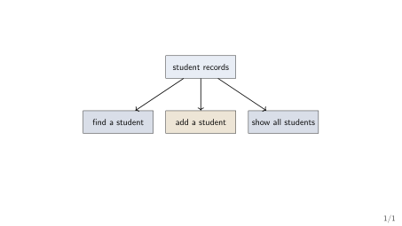

# The Big Idea

## Welcome to Data Structures

::: {.methodbox}
**The simple idea.** A data structure is a way to keep data organised so that a
program can use it [@Sedgewick2011_algorithms; @Karumanchi2017_data_structures_algorithms_made_easy].
:::

- Data: student names, marks, books, messages, or numbers.
- Structure: the way those items are arranged in memory.
- Operations: the things we want to do, such as find, add, or remove.

[This course starts with the idea, then slowly adds code.]{.neutral}

## A Familiar Example: Finding a Book

::: {.methodbox}
**Situation.** You need one book from a shelf of 1,000 books.
:::

- If the books are mixed up, you check them one at a time.
- If the books are arranged by title, you can go directly to the right area.
- The books are the same. The arrangement is different.

::: {.highlightbox}
**The course question.** Which arrangement makes the job easy?
:::

## Correct Is Not Always Convenient

::: {.methodbox}
**A correct program.** A loop can check every student record and eventually
find the right student.
:::

- With five records, this feels easy.
- With millions of records, the same idea may feel slow.
- We do not change the answer. We change the way the records are kept.

[**Data structures help a correct program remain useful as data grows.**]{.hi-gold}

## What You Already Know

- Variables store values.
- Arrays store several values in a row.
- Functions divide a program into manageable pieces.
- Loops repeat work.

::: {.highlightbox}
**What this course adds.** We will ask: "What arrangement fits this job?"
:::

## Try It: Choose the Arrangement

::: {.methodbox}
**You are designing a college library app. Which task matters most?**

1. Show books in the order they were added.
2. Find a book by its title.
3. Add a newly returned book to the available-books list.
:::

- There is not one best arrangement for every task.
- First name the frequent operation; only then choose a structure.

::: {.highlightbox}
**Pair question.** Which task would you design for first, and why?
:::

## A Slightly Harder Choice

::: {.methodbox}
**Library workload for one day.** 90 students search for books. 10 books are
added to the catalogue.
:::

1. Which operation should the arrangement favour?
2. Would your answer change if 90 books were added and only 10 searches happened?
3. What information is still missing before you choose an implementation?

::: {.highlightbox}
**Design habit.** Choose for the common workload, not for the most interesting
operation.
:::

## Engineering Means Balancing Costs

::: {.methodbox}
**A library catalogue has three competing goals.** Fast search, easy updates,
and reasonable memory use.
:::

- Sorting the catalogue can make searching easier.
- Keeping the catalogue unsorted can make new-book updates simpler.
- Keeping extra indexes can speed searches but uses more memory and code.

::: {.highlightbox}
**Engineering question.** Which cost is most important for this library, and
what evidence would you collect?
:::

# The Roadmap

## The Course Roadmap

1. [**Weeks 1--2: Foundations**]{.hi-gold} --- memory, pointers, and the cost of work.
2. [**Weeks 3--5: Useful linear structures**]{.hi-gold} --- arrays, stacks, and queues.
3. [**Weeks 6--7: Linked structures**]{.hi-gold} --- data that can grow and change.
4. [**Weeks 8--10: Finding and ordering**]{.hi-gold} --- searching, sorting, and files.
5. [**Weeks 11--12: Connected data**]{.hi-gold} --- trees, graphs, and hashing.

[We will not learn everything today. Today we learn where we are going.]{.neutral}

## One Small Story Through the Course

::: {.keybox}
**Our running example.** A small program reads an expression such as `(a+b)*c`.
:::

- A [**stack**]{.hi-gold} can help check brackets.
- A [**queue**]{.hi-gold} can help process items in arrival order.
- A [**list**]{.hi-gold} can hold a changing collection of names.
- A [**tree**]{.hi-gold} or [**hash table**]{.hi-gold} can help organise lookups.

[Stacks, queues, lists, trees, and hash tables are exactly the structures
every working programmer reaches for first
[@Karumanchi2017_data_structures_algorithms_made_easy] --- and exactly
the ones this course covers.]{.neutral}

## The Same Data, Different Jobs

{fig-align="center"}

::: {.methodbox}
**Important.** The best structure depends on what the program does most often.
:::

## How to Learn This Course

- Draw a small picture before writing code.
- Say what each operation should do in plain language.
- Trace one example by hand.
- Write a little code, compile it, and test it.
- Ask "why this structure?" rather than only memorising its name.

[Small traces are more useful than large memorised programs.]{.positive}

## The Four Questions We Will Keep Asking

1. What data do we have?
2. What operations do we need?
3. How should the data be arranged?
4. What does that arrangement make easy or difficult?

::: {.highlightbox}
**Today's takeaway.** Data structures are choices about organisation.
:::

## A Small Challenge Before Week 1

::: {.methodbox}
**Predict.** A class stores 30 student names. Tomorrow, the class may grow to 300.
:::

1. What information would the program need before choosing a structure?
2. Which operation might be more important: adding, finding, or displaying?
3. What would you draw first: the data or the code?

[There is no single correct answer yet. We are practising the questions.]{.neutral}

## Next Week: Where Does Data Live?

::: {.methodbox}
**Our first practical question.** When a C program runs, where do its
variables and data live?
:::

- We will meet the [**stack**]{.hi-gold} and the [**heap**]{.hi-gold}.
- We will see what a [**pointer**]{.hi-gold} stores.
- We will allocate and release one small block of memory.

[No need to know these ideas yet. Bring your questions.]{.neutral}

## Week 0 Summary

- A data structure organises data for useful operations.
- The same correct program can become inconvenient when data grows.
- This course moves from simple structures to more flexible ones.
- We choose structures by looking at the workload they must serve.
- The first step is understanding memory and pointers.

## References

::: {#refs}
:::
