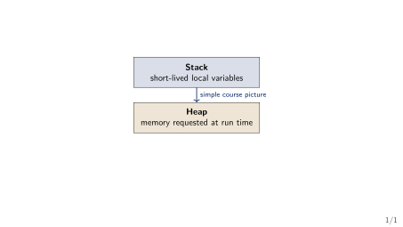
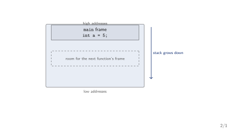
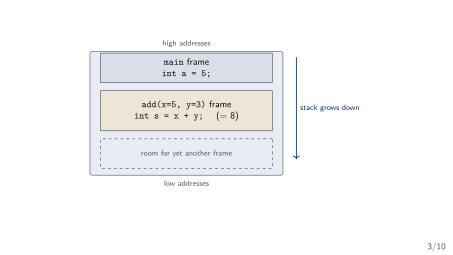
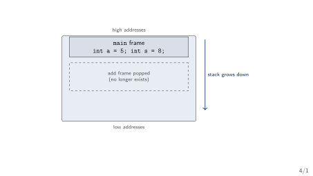
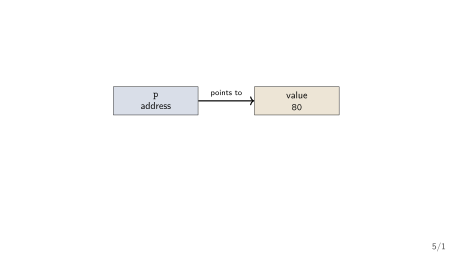
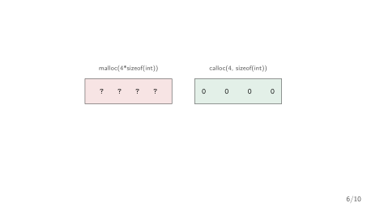
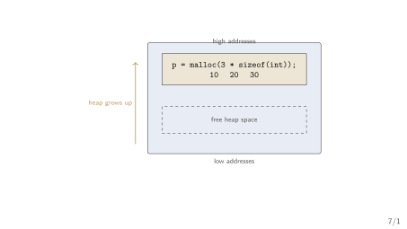
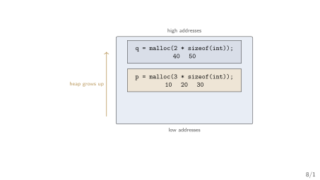
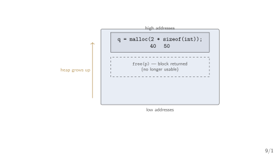
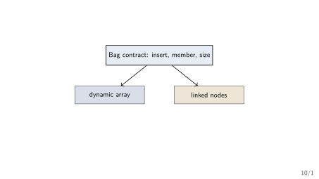

## Today's Three Questions

1. Where does a running C program keep its data?
2. How can we use memory that we request while the program runs?
3. How can we describe a data structure before implementing it?

::: {.highlightbox}
**Plan.** First draw the memory. Then use one pointer. Then write one simple contract.
:::

## Motivation: Correct Is Not Always Fast Enough

::: {.keybox}
**A correct program can still be unusable.** A loop that scans student records one by one always finds the right student --- and with 5 records it is instant.
:::

- With 10 million records and a query every millisecond, the *same* correct loop is far too slow.
- The answer is the same; the *arrangement* of the data is the difference.
- This course is the catalogue of arrangements and the judgement to choose between them [@HorowitzSahni2008_fundamentals_data_structures; @AhoHopcroftUllman1983_data_structures_algorithms].

[Data structures keep a correct program useful as the data grows.]{.hi-gold}

## Motivation: "It Felt Fast" Is Not an Argument

::: {.quotebox}
*"How long will my program take? Why does my program run out of memory?"* --- questions far too vague to answer precisely without a model [@Sedgewick2011_algorithms].
:::

- "It felt fast in my test" tells us nothing about tomorrow's input.
- Week 2 gives us the model: count the operations as a function of the amount of data, then compress the count into $O$/$\Omega$/$\Theta$.
- Week 1's job is the raw material that analysis counts --- how data is laid out and reached in memory.

[By the end of Week 12 you will say *why* a structure is fast, not just that it felt fast.]{.neutral}

## The Course in One Roadmap

1. **Weeks 1--2: Foundations** --- memory, pointers, and the cost of work.
2. **Weeks 3--5: Linear structures** --- arrays, stacks, queues, expression processing.
3. **Weeks 6--7: Linked structures** --- singly/doubly linked lists, their applications.
4. **Weeks 8--9: Finding and ordering** --- searching, elementary and efficient sorting.
5. **Week 10: Files and hashing** --- file organization, hash tables.
6. **Weeks 11--12: Connected data** --- trees, BSTs, AVL, graphs, MSTs, shortest paths.

[Each week repeats one shape: *state the contract, then implement it, then analyse what it costs*.]{.neutral}

## One Running Thread Through the Whole Course

::: {.alertbox}
**Our running example.** A small expression processor reads `(a+b)*c` and must check its brackets, convert it, evaluate it, and look up its identifiers.
:::

- A **stack** checks the brackets and drives the conversion (Weeks 3--4).
- A **symbol table** --- first a list (Week 6), later a hash table (Week 10) --- stores the identifiers.
- An **expression tree** gives the evaluation (Week 11).
- Every new structure arrives as the fix for something this program cannot yet do.

[This is not twelve unrelated topics; it is one program learning new tricks each week.]{.neutral}

## What You Already Know

- Variables store values.
- Arrays store several values in a row.
- Functions divide a program into manageable pieces.
- Loops repeat work.
- C gives you `struct` for grouping fields.

::: {.highlightbox}
**What this course adds.** We ask: *what arrangement of data fits this job?* --- and we answer with a contract, an implementation, and a cost.
:::

## {.transition-slide}

Before any structure: where does a program even put its data?

## A Variable Has a Place

::: {.methodbox}
**Example.** `int marks = 80;` stores the value `80` somewhere in memory.
:::

- The variable has a name: `marks`.
- It has a value: `80`.
- It also has an address: its place in memory.

[An address is like a house number. It tells us where to look.]{.neutral}

## {.section-divider}

::: {.section-divider-label}
Section 1
:::

::: {.section-divider-title}
Memory
:::

## Two Places to Remember

{fig-align="center"}

- Local variables usually live in the stack.
- Dynamic memory lives in the heap.

## How the Stack Grows --- Step 1: `main` starts

{fig-align="center"}

- Starting `main` creates one frame holding its local variables.
- Every new function call pushes a new frame just below the current one.

## How the Stack Grows --- Step 2: `add` is called

{fig-align="center"}

- The call to `add` pushed a second frame with its parameters and locals.
- The new frame sits at a [lower]{.hi-gold} address than `main`'s frame.

## How the Stack Grows --- Step 3: `add` returns

{fig-align="center"}

- Returning popped the frame, and its memory is available again.
- The answer `8` was copied back into `main`'s frame.

## The Stack: Automatic Storage

::: {.methodbox}
**Local variable.** A variable declared inside a function is created when the function starts.
:::

- It is available while that function is running.
- It disappears when the function returns.
- The program manages this basic lifetime automatically.

::: {.highlightbox}
**Example.** `int score = 80;` inside a function is a local variable.
:::

## Why Do We Need the Heap?

::: {.methodbox}
**A changing problem.** The user enters the number of records only after the program starts.
:::

- We may need space for 3 records today and 300 tomorrow.
- We may want the records to remain after a helper function returns.
- The heap gives us memory whose size and lifetime we can request at run time.

[The heap is useful when the data must be flexible.]{.hi-gold}

## Check Your Prediction

::: {.methodbox}
**Which variable can outlive the function that created it?** `int score = 80;` &nbsp;&nbsp;or&nbsp;&nbsp; `int *p = malloc(sizeof(int));`
:::

- The local variable `score` belongs to its function call.
- The heap block remains until the program releases it with `free`.
- The pointer is only the handle; the block is the data storage.

::: {.highlightbox}
**Turn and talk.** What must remain available if another function needs the record later?
:::

[The exact call for this --- `malloc` and `sizeof` --- comes in a few slides.]{.neutral}

## {.transition-slide}

To use the heap, we need a handle on it --- a pointer.

## {.section-divider}

::: {.section-divider-label}
Section 2
:::

::: {.section-divider-title}
Pointers
:::

## What Is a Pointer?

::: {.methodbox}
**Definition.** A pointer is a variable that stores an address [@Wirth2004_algorithms_data_structures].
:::

- An ordinary variable stores a value such as `80`.
- A pointer stores a place such as "where the score lives".
- The type tells C what kind of value is at that place.

::: {.highlightbox}
**One declaration.** `int *p;` means: `p` can point to an `int`.
:::

## A Pointer Picture

{fig-align="center"}

- `p` does not contain the score itself.
- `p` tells us where the score can be found.

## A Pointer Can Reach a Node

::: {.methodbox}
**A two-field node**

```c
struct node {
  int data;
  struct node *next;
};
```
:::

- `data` stores the value.
- `next` stores the address of another node.
- If there is no next node, set `next = NULL`.

[This is the basic building block for a linked list in a later week.]{.neutral}

## The Safe Empty Pointer

::: {.methodbox}
**`NULL`.** `NULL` means that a pointer is not pointing to a valid object.
:::

- Use it to show that a pointer is currently empty.
- Check a pointer before using the object it should point to.
- Never try to read through an empty pointer.

::: {.highlightbox}
**Picture.** `struct node *head = NULL;` means "the list is empty".
:::

## {.transition-slide}

Now let us actually request a block of heap memory and use it.

## {.section-divider}

::: {.section-divider-label}
Section 3
:::

::: {.section-divider-title}
One Heap Block
:::

## Requesting One Integer

::: {.methodbox}
**The basic pattern**

```c
int *p = malloc(sizeof(int));
if (p == NULL) return 1;
*p = 80;
```
:::

- `malloc` requests bytes from the heap.
- `sizeof(int)` asks C for the right number of bytes.
- `p` stores the address of the requested space.

## Allocate a Complete Node

::: {.methodbox}
**A safer engineering pattern**

```c
struct node *p = malloc(sizeof(struct node));
if (p == NULL) return 1;
p->data = 42;
p->next = NULL;
```
:::

- `sizeof(struct node)` asks for exactly one node's bytes.
- `p->data` means: the `data` field of the node `p` points at.
- Initialising every field makes the node's state predictable.
- This node has a clear end: `p->next == NULL`.

## Audit the Node Before You Ship It

::: {.methodbox}
**Review checklist.** A small program is not finished when it compiles.
:::

1. Was the allocation checked against `NULL`?
2. Was every field initialised before the node was used?
3. Is there exactly one clear owner responsible for `free(p)`?
4. Can the program reach the node later, or has its pointer been lost?

::: {.highlightbox}
**Engineering habit.** Test the normal path and the allocation-failure path.
:::

## Trace It Before Running It

::: {.methodbox}
**After these lines, what is true?**

```c
int *p = malloc(sizeof(int));
*p = 80;
```
:::

1. `p` contains an address.
2. The heap block at that address contains `80`.
3. The name `p` itself is not the heap block.

::: {.highlightbox}
**Challenge.** Which line would fail if `p == NULL`?
:::

## What Happened?

{fig-align="center"}

1. C found a free heap block.
2. The address was stored in `p`.
3. We used `*p` to write the value `80` there.

## How the Heap Grows --- Step 1: a block of three ints

{fig-align="center"}

- One `malloc` with room for three integers [grew the used heap]{.hi-gold} upward.
- The block survives after the allocating function returns.

## How the Heap Grows --- Step 2: a second block

{fig-align="center"}

- The second request placed `q`'s block at a [higher]{.hi-gold} address.
- Blocks are independent; each keeps its own data.

## How the Heap Grows --- Step 3: `free` returns a block

{fig-align="center"}

- `free(p)` gives `p`'s block back to the system.
- `q`'s block is untouched, and the used heap can shrink again.

## Returning the Memory

::: {.methodbox}
**When the block is no longer needed**

```c
free(p);
p = NULL;
```
:::

- `free(p)` gives the heap block back to the system.
- Setting `p` to `NULL` makes the old pointer visibly empty.
- A block requested with `malloc` should eventually be freed.

[Request memory, use it, return it.]{.positive}

## Two Beginner Mistakes

- [Memory leak]{.negative}: forget to call `free`; the block stays reserved.
- [Dangling pointer]{.negative}: use a pointer after its block was freed.

::: {.highlightbox}
**Simple habit.** Keep track of who requested the memory and who will return it.
:::

## {.transition-slide}

Memory and pointers are the machinery. The contract is the map.

## {.section-divider}

::: {.section-divider-label}
Section 4
:::

::: {.section-divider-title}
Simple Contracts
:::

## What Is an ADT?

::: {.methodbox}
**Abstract Data Type.** An ADT describes what we can do with data, without saying how it is stored [@Sedgewick2011_algorithms; @Karumanchi2017_data_structures_algorithms_made_easy].
:::

- It is a promise about operations.
- The implementation is the code and memory arrangement behind the promise.
- Different implementations can follow the same promise.

[An ADT has two parts: a declaration of data, and a declaration of operations [@Karumanchi2017_data_structures_algorithms_made_easy].]{.neutral}

## This Course Is a Tour of ADTs

::: {.methodbox}
**The pattern you will see every week.** Linked Lists, Stacks, Queues, Priority Queues, Binary Trees, Disjoint Sets, Hash Tables, and Graphs are all commonly used ADTs [@Karumanchi2017_data_structures_algorithms_made_easy].
:::

- Each one starts the same way: state the contract, *then* implement it.
- Weeks 3--12 work through this list one ADT at a time.
- Today's "bag" is a warm-up for that pattern, not a one-off example.

[Watch for this shape: "What is a Stack?" then "Stack ADT" then "Implementation" --- every week, same order.]{.neutral}

## Example: A Very Small Bag

::: {.methodbox}
**The contract.** A bag of integers supports three operations:
:::

1. `insert(x)` --- put `x` into the bag.
2. `member(x)` --- answer whether `x` is present.
3. `size()` --- report how many items are present.

[The contract does not yet say whether the bag uses an array or a list.]{.neutral}

## One Contract, Two Possible Implementations

{fig-align="center"}

::: {.methodbox}
**The key distinction.** Same operations, different internal arrangement.
:::

## Contract or Implementation?

::: {.methodbox}
**Classify each statement.** Is it part of the contract, or part of one implementation?
:::

1. "`member(7)` answers yes or no."
2. "The values are stored in an array."
3. "`size()` reports the number of values."

[The first and third describe what users can ask. The second describes how.]{.neutral}

## Week 1 Summary

- The stack holds ordinary short-lived local variables.
- The heap holds memory requested while the program runs.
- A pointer stores an address; `NULL` means "points to nothing".
- Use `malloc`, check the result, use the block, and call `free`.
- An ADT describes operations; a data structure implements them.
- The rest of this course is a tour of ADTs: contract first, implementation second.

::: {.highlightbox}
**Next week.** We will learn how to talk about the amount of work an operation needs.
:::

## References

::: {#refs}
:::
