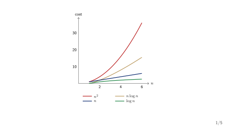
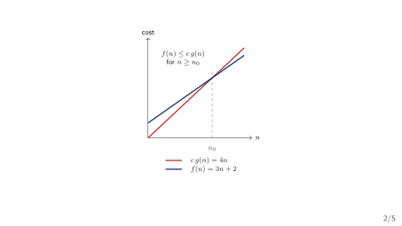
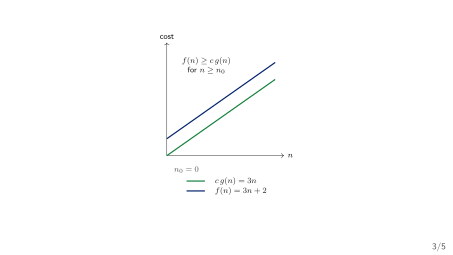
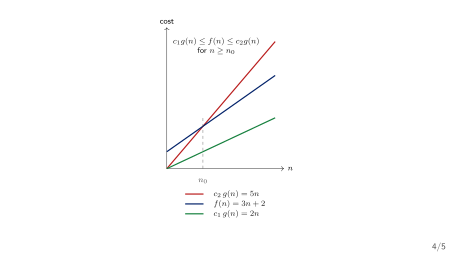
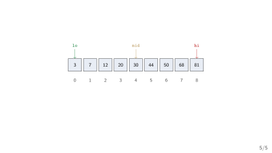

## Today's Three Questions

1. How do we measure the work an operation does?
2. How do we compare two correct solutions without running both on every input?
3. How do we say how much memory a solution needs?

::: {.highlightbox}
**Plan.** First count the work. Then compress the count into a simple class. Then apply it to our two searches.
:::

## The Calculator's Growing Symbol Table

::: {.keybox}
**Our running example.** The expression processor from Week 1 reads `(a+b)*c` and stores each identifier --- `a`, `b`, `c` --- in a symbol table it must look up by name.
:::

- A one-line expression has two or three identifiers; a real calculator session may hold thousands.
- Last week the table was "a list for now, a hash table later."
- [**This week's question**]{.hi-gold}: as the table grows, how do we predict whether a lookup stays fast --- before we build either one?

[The answer cannot be "we will time it and see." We need a model.]{.neutral}

## Same Answer, Very Different Work

::: {.methodbox}
**Two ways to find the value bound to a name.** (1) Scan the table from the top. (2) Keep the table sorted and jump to the middle.
:::

- Both are correct: both return the same value, or report "not found."
- With 10 names, both finish before you notice.
- With 10 million names, the first is thousands of times slower --- yet neither has changed a single line of its logic.

[**Correctness and cost are two different questions.** Week 1 answered the first; this week we answer the second.]{.hi-gold}

## "It Felt Fast" Is Not an Argument

::: {.methodbox}
**Sedgewick's opening question.** *"How long will my program take? Why does my program run out of memory?"* --- questions too vague to answer without a mathematical model [@Sedgewick2011_algorithms].
:::

- Timing one run on one machine measures that run, not the algorithm.
- A faster machine shifts the numbers but not the story.
- What we need is a model that counts the *work* as a function of the *size* of the data --- independent of the clock.

[Sedgewick poses these questions at the head of his analysis chapter (p.172).]{.neutral}

## The Model in One Line

::: {.methodbox}
**Cost model.** Count the basic operations as a function of $n$, the number of elements; then compress the count into one asymptotic class [@HorowitzSahni2008_fundamentals_data_structures; @Neapolitan2010_foundations_of_algorithms].
:::

- [**Measure**]{.hi-gold}: pick a basic operation and count how often it runs.
- [**Compress**]{.hi-gold}: keep only the term that grows fastest.
- [**State the case**]{.hi-gold}: best, worst, or average.

[Both prescribed texts treat analysis this way --- Horowitz & Sahni (Ch. 1) and Neapolitan & Naimipour (Ch. 1--2) --- at chapter level.]{.neutral}

## {.transition-slide}

To compare two solutions, we first have to count the work.

## {.section-divider}

::: {.section-divider-label}
Section 1
:::

::: {.section-divider-title}
Counting Work
:::

## What Is a Basic Operation?

::: {.methodbox}
**Basic operation.** A single step whose cost is roughly constant: a comparison, an assignment, an array access, or one arithmetic operation [@Sedgewick2011_algorithms].
:::

- We do not count microseconds; we count steps.
- We choose the operation that *dominates* --- for search, the comparison `A[i] == key`.
- Counting one well-chosen operation gives the right shape of growth.

[The cost model is a simplification on purpose: exact machine time is unknowable, but the step count is not.]{.neutral}

## The Cost Function $T(n)$

::: {.methodbox}
**Definition.** $T(n)$ is the number of basic operations the algorithm performs on an input of size $n$.
:::

- $n$ always counts the elements under discussion --- here, the length of the array `A[0..n-1]`.
- $T(n)$ is a *function*, not a single number: it answers "how many steps?" for every size at once.

::: {.highlightbox}
**Notation you already have.** $n$ and arrays --- both from Week 1. $T(n)$ is new today.
:::

## Linear Search: Count the Comparisons

::: {.methodbox}
**Scan the array for `key`**

```c
int linear_search(int A[], int n, int key) {
    for (int i = 0; i < n; i++)
        if (A[i] == key)
            return i;
    return -1;
}
```
:::

- The basic operation is the comparison `A[i] == key`.
- The loop runs from `i = 0` up to `n - 1`.
- How many comparisons? It depends on *where* `key` sits --- or whether it sits anywhere at all.

## $T(n)$ Depends on the Input, Not Just on $n$

::: {.methodbox}
**Same size, different cost.** Search `A = [10, 20, 30, 40, 50]` (so $n = 5$) for `key = 10` and then for `key = 99`.
:::

- `key = 10`: the very first comparison succeeds --- $1$ step.
- `key = 99`: every element is checked --- $n = 5$ steps.

[Both inputs have size $n = 5$. The cost is not a single number, so we describe it over the *kinds* of input.]{.neutral}

## Best, Worst, and Average Case

::: {.methodbox}
**Three questions about the same algorithm.** How does cost behave on the most favourable, the least favourable, and the typical input of size $n$? [@Karumanchi2017_data_structures_algorithms_made_easy]
:::

- [**Best case**]{.hi-gold}: the minimum cost over all inputs of size $n$.
- [**Worst case**]{.hi-gold}: the maximum cost over all inputs of size $n$.
- [**Average case**]{.hi-gold}: the expected cost, given a distribution of inputs.

[A *case* is a property of the input; a *bound* ($O$/$\Theta$) is a property of the function. They are orthogonal --- we pair them, never confuse them.]{.neutral}

## Linear Search: All Three Cases

::: {.methodbox}
**Counting the comparison `A[i] == key`.** For an array `A[0..n-1]`:
:::

- [**Best case**]{.hi-gold}: `key == A[0]` --- exactly $1$ comparison.
- [**Worst case**]{.hi-gold}: `key` absent, or at `A[n-1]` --- $n$ comparisons.
- [**Average case**]{.hi-gold}: successful search, key equally likely at each position --- $\frac{n+1}{2}$ comparisons.

[Average case derivation: $\frac{1}{n}(1 + 2 + \dots + n) = \frac{n(n+1)}{2n} = \frac{n+1}{2}$.]{.neutral}

## Check Your Prediction

::: {.methodbox}
**Which input forces the most work?** For `linear_search`, which $5$-element input makes it do all $5$ comparisons?
:::

1. `key` equal to `A[0]`.
2. `key` equal to `A[4]`.
3. `key` equal to a value not in the array.

::: {.highlightbox}
**Turn and talk.** A value in the last position and a value nowhere in the array both cost $n$. Which one tells us more about how bad it can get --- and why?
:::

## {.transition-slide}

Exact counts are messy. We want the shape of the growth.

## {.section-divider}

::: {.section-divider-label}
Section 2
:::

::: {.section-divider-title}
Asymptotic Notation
:::

## Why Ignore the Constants?

::: {.methodbox}
**The doubling argument.** If $T(n) = 3n + 2$ and we double the input, the cost roughly doubles --- no matter how large the constant $3$ is.
:::

- $3n + 2$ and $7n - 5$ both *grow like $n$*; they differ only by a constant factor.
- Constant factors matter to a machine, but not to *how the cost scales* as $n$ grows.
- Lower-order terms ($+2$) disappear entirely when $n$ is large.

[**Asymptotic analysis keeps the dominant term and drops constants.**]{.hi-gold}

## Orders of Growth

::: {.methodbox}
**Sedgewick's classification (p.187).** A handful of classes cover almost every algorithm we will meet [@Sedgewick2011_algorithms].
:::

| Order | Name | Typical of |
|---|---|---|
| $1$ | constant | one statement |
| $\log n$ | logarithmic | binary search |
| $n$ | linear | linear search |
| $n \log n$ | linearithmic | mergesort |
| $n^2$ | quadratic | nested loops |
| $n^3$ | cubic | triple loops |

{fig-align="center"}

## Big-$O$: an Upper Bound

::: {.methodbox}
**Definition.** $T(n) = O(g(n))$ if there exist constants $c > 0$ and $n_0 \geq 0$ such that

$$T(n) \leq c \cdot g(n) \quad\text{for all } n \geq n_0.$$
:::

- "$T(n)$ grows no faster than $g(n)$, up to a constant."
- $O$ answers: *at worst, roughly how much work?*
- A one-sided guarantee --- an upper bound, possibly loose.

{fig-align="center"}

## Big-$O$ at Work: $T(n) = 3n + 2$

::: {.methodbox}
**Claim: $T(n) = 3n + 2$ is $O(n)$.** For every $n \geq 2$, we have $3n + 2 \leq 4n$.
:::

- Choose $c = 4$ and $n_0 = 2$; then $3n + 2 \leq 4n$ holds.
- Therefore $T(n) = O(n)$.
- The exact function was $3n + 2$; the class is just $O(n)$.

::: {.highlightbox}
**Reading it aloud.** "The running time is of order $n$." --- [we have already thrown away the $3$ and the $2$.]{.neutral}
:::

## Big-$\Omega$: a Lower Bound

::: {.methodbox}
**Definition.** $T(n) = \Omega(g(n))$ if there exist $c > 0$ and $n_0 \geq 0$ such that

$$T(n) \geq c \cdot g(n) \quad\text{for all } n \geq n_0.$$
:::

- "$T(n)$ grows *at least* as fast as $g(n)$, up to a constant."
- $\Omega$ answers: *at best, roughly how much work?*

::: {.highlightbox}
**Example.** $3n + 2$ is $\Omega(n)$: take $c = 3$, so $3n + 2 \geq 3n$ for all $n \geq 0$.
:::

{fig-align="center"}

## Big-$\Theta$: a Tight Bound

::: {.methodbox}
**Definition.** $T(n) = \Theta(g(n))$ when $T(n)$ is *both* $O(g(n))$ and $\Omega(g(n))$.
:::

- "$T(n)$ grows *exactly* like $g(n)$, up to a constant."
- $\Theta$ squeezes the cost from above and below.
- $3n + 2$ is $\Theta(n)$: bounded below by $2n$, above by $5n$.

[$\Theta$ is the strongest claim of the three --- use it only when the two bounds actually meet.]{.neutral}

{fig-align="center"}

## The Strict Siblings: $o$ and $\omega$

::: {.methodbox}
**When the gap is strict, not just up to a constant.** $T(n) = o(g(n))$ means $T(n)/g(n) \to 0$; $T(n) = \omega(g(n))$ means $T(n)/g(n) \to \infty$.
:::

- $o$ is a strict upper bound: $n = o(n^2)$, but $2n$ is *not* $o(n)$.
- $\omega$ is a strict lower bound: $n^2 = \omega(n)$, but $2n$ is *not* $\omega(n)$.
- The strict forms are rarely needed; we will mostly write $O$, $\Omega$, $\Theta$.

## Reading Notation Correctly

::: {.methodbox}
**A bound must always name its case.** "Linear search is $O(n)$" is incomplete --- *in which case?*
:::

- [Linear search is $O(n)$ in the worst case.]{.positive}
- [Linear search is $\Omega(1)$ in the best case.]{.positive}
- [Binary search is $O(\log n)$]{.negative} --- [no case stated.]{.neutral}
- [$T(n) = O(n)$, so exactly $n$ steps]{.negative} --- [confuses a class with a count.]{.neutral}

[**Pair every complexity claim with the case, and name the operation.**]{.hi-gold}

## {.transition-slide}

Now apply the vocabulary to our two searches.

## {.section-divider}

::: {.section-divider-label}
Section 3
:::

::: {.section-divider-title}
Two Searches, Two Costs
:::

## Linear Search, Analysed

::: {.methodbox}
**Cost of `linear_search`.** Basic operation: the comparison `A[i] == key`.
:::

- [**Worst case**]{.hi-gold}: $n$ comparisons --- the trace: `key` absent, every `A[i]` examined once.
- [**Best case**]{.hi-gold}: $1$ comparison --- `key == A[0]`.
- [**Average case**]{.hi-gold}: $\frac{n+1}{2} = \Theta(n)$ comparisons.

[Every claim above names its case, and each is matched to the input that exhibits it.]{.neutral}

## Binary Search Needs a Sorted Table

::: {.methodbox}
**Precondition (an invariant, not an option).** Binary search is only correct when the array is sorted. On an unsorted array it can silently return a wrong answer.
:::

- The sorted order is *what makes halving valid*: after one comparison we can discard an entire half.
- Keeping the table sorted is itself a cost --- the price we pay for fast lookups later.
- [This is the anti-pattern to guard: never apply binary search without first stating the sorted precondition.]{.neutral}

## Binary Search

::: {.methodbox}
**Jump to the middle, then discard a half**

```c
int binary_search(int A[], int n, int key) {
    int lo = 0, hi = n - 1;
    while (lo <= hi) {
        int mid = lo + (hi - lo) / 2;
        if (A[mid] == key) return mid;
        else if (A[mid] < key) lo = mid + 1;
        else                  hi = mid - 1;
    }
    return -1;
}
```
:::

- Each pass compares `A[mid]` and shrinks `[lo, hi]` by half.
- `A` must already be sorted, in ascending order.

## Binary Search: the Halving Picture

{fig-align="center"}

- `mid = lo + (hi - lo) / 2` lands on index $4$ (value $30$).
- $30 < 68$, so the left half is discarded and `lo` jumps to $5$.

## Binary Search Trace (key = 68)

| pass | `lo` | `hi` | `mid` | `A[mid]` |
|---|---|---|---|---|
| 1 | 0 | 8 | 4 | $30 < 68$ |
| 2 | 5 | 8 | 6 | $50 < 68$ |
| 3 | 7 | 8 | 7 | $68 = 68$ --- found |

- Three passes to find `key = 68` among $n = 9$ values.
- A linear scan would check $7$ of the $9$ cells (worst case: all $9$).

[Each pass discards half the remaining interval --- that is the engine of the logarithmic bound.]{.neutral}

## Binary Search, Analysed

::: {.methodbox}
**Cost of `binary_search`.** Basic operation: the comparison `A[mid] == key`.
:::

- Each pass halves the interval $[\,\texttt{lo}, \texttt{hi}\,]$; after $k$ passes at most $\lceil n/2^k \rceil$ elements remain.
- The loop stops when the interval is empty, so the number of passes is about $\log_2 n$.

[**Binary search is $O(\log n)$ in the worst case --- and $\Omega(1)$ in the best case (key at `A[mid]` on the first pass).**]{.hi-gold}

[$\log$ is the base-2 logarithm here; its base is a constant factor, which asymptotic notation drops anyway.]{.neutral}

## A Nested Loop: Checking for Duplicates

::: {.methodbox}
**Does the symbol table hold the same name twice?**

```c
for (int i = 0; i < n; i++)
    for (int j = i + 1; j < n; j++)
        if (A[i] == A[j])
            return 1;  /* duplicate found */
```
:::

- The inner loop runs $n - i - 1$ times for each $i$.
- Total comparisons: $\sum_{i=0}^{n-2}(n-i-1) = \frac{n(n-1)}{2}$.
- This is $\Theta(n^2)$ --- *in every case*, since the loop always runs to completion unless a duplicate is found.

## The Numbers Side by Side

| $n$ | $\log_2 n$ | $n$ | $n \log_2 n$ | $n^2$ |
|---|---|---|---|---|
| $10$ | $\approx 3$ | $10$ | $\approx 33$ | $10^2$ |
| $10^3$ | $\approx 10$ | $10^3$ | $\approx 10^4$ | $10^6$ |
| $10^6$ | $\approx 20$ | $10^6$ | $\approx 2\cdot10^7$ | $10^{12}$ |

::: {.methodbox}
**What the table says.** As $n$ grows, $\log n$ barely moves while $n^2$ explodes --- the difference between a search that is practical and one that is not.
:::

## The Symbol Table Payoff

::: {.methodbox}
**The same table, three later homes.** Our calculator's identifier lookup, analysed as $n$ grows:
:::

- [**Unsorted list**]{.hi-gold} (Week 6): lookup is $O(n)$ worst case --- scan it all.
- [**Sorted array**]{.hi-gold}: lookup is $O(\log n)$ worst case --- but keeping it sorted costs on every insert.
- [**Hash table**]{.hi-gold} (Week 10): lookup is $O(1)$ expected --- the whole reason we will want one.

[Week 2 gives us the vocabulary to make this trade-off precise; Weeks 6 and 10 will act on it.]{.neutral}

## {.transition-slide}

Time is only half the bill --- memory matters too.

## {.section-divider}

::: {.section-divider-label}
Section 4
:::

::: {.section-divider-title}
Space
:::

## Space Complexity $S(n)$

::: {.methodbox}
**Definition.** $S(n)$ is the amount of memory an algorithm uses beyond its input --- its *auxiliary* space --- as a function of $n$.
:::

- [**Input space**]{.hi-gold}: the $n$ elements themselves --- counted separately.
- [**Auxiliary space**]{.hi-gold}: the extra working memory the algorithm needs.
- $S(n)$ is stated the same way as $T(n)$, in asymptotic classes.

[We separate the two because "uses $n$ cells" is uninteresting when the input already has $n$ cells; the extra is the real question.]{.neutral}

## Space of Our Examples

::: {.methodbox}
**Auxiliary space, one constant at a time.** Each of today's algorithms keeps only a handful of local variables.
:::

- `linear_search`: one index `i` --- auxiliary space $O(1)$.
- `binary_search`: three indices `lo`, `hi`, `mid` --- auxiliary space $O(1)$.
- A *recursive* binary search would instead use $O(\log n)$ stack frames --- the recursion depth.

::: {.highlightbox}
**Why it matters.** $O(1)$ auxiliary space means the extra memory does not grow with $n$ --- a property we will price carefully when Week 9 compares in-place and merge-sort. [The pointer intuition is Week 1's: each variable is one cell, wherever it lives.]{.neutral}
:::

## Three Common Mistakes

- [Treating $T(n) = O(n)$ as an exact count]{.negative} --- $O(n)$ is a class, not "$n$ steps."
- [Stating a bound with no case]{.negative} --- "$O(n)$" without worst/best/average leaves the claim unfalsifiable.
- [Mixing up $O$ and $\Theta$]{.negative} --- $O$ is an upper bound; only $\Theta$ says the growth matches exactly.

::: {.highlightbox}
**The habit.** Name the operation, give the bound, state the case, and point to the input that exhibits it.
:::

## Week 2 Summary

- [**Cost model**]{.hi-gold}: count a basic operation as a function of $n$.
- [**$T(n)$**]{.hi-gold}: the exact cost function; [**$S(n)$**]{.hi-gold}: the auxiliary space.
- [**Asymptotic classes**]{.hi-gold}: $O$ (upper), $\Omega$ (lower), $\Theta$ (tight), with $o$ and $\omega$ as the strict forms.
- [**Cases**]{.hi-gold}: best, worst, average --- orthogonal to the bound, always stated with it.
- [**Our two searches**]{.hi-gold}: linear $O(n)$ worst case vs. binary $O(\log n)$ worst case; a nested loop is $\Theta(n^2)$.

::: {.highlightbox}
**Next week.** Arrays and the Stack ADT --- the first structure we will analyse end to end.
:::

## Before You Go: Predict

::: {.methodbox}
**Doubling the table.** The calculator's symbol table doubles from $n$ to $2n$ names. Which lookup grows how?
:::

1. A linear scan: roughly how much slower?
2. A binary search: roughly how much slower?
3. A duplicate check with the nested loop: roughly how much slower?

[Your answers --- "doubles", "one extra pass", "four times" --- are the whole point of the asymptotic vocabulary.]{.neutral}

## References

::: {#refs}
:::
