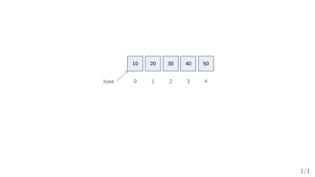
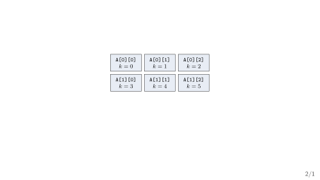
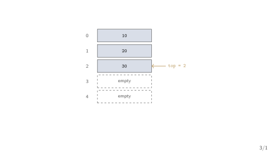

## Today's Three Questions

1. How does the machine find `A[i]` without scanning for it?
2. How do we describe a "last in, first out" store before coding it?
3. What do brackets and postfix expressions have to do with that store?

::: {.highlightbox}
**Plan.** First lay out memory in a row. Then name the stack contract. Then use one stack to check brackets and evaluate postfix.
:::

## The Calculator Needs Two Things

::: {.keybox}
**Our running example.** The expression processor reads `(a+b)*c`: it stores operands somewhere, and it must check the brackets and evaluate the expression.
:::

- Week 1 gave it heap blocks; Week 2 gave it a way to price lookups.
- Operands arrive in order --- we want the $i$-th one *instantly*.
- Brackets nest --- the *last* opened bracket must close *first*.

[One need is positional (arrays); the other is nested (stacks).]{.neutral}

## Positional vs. Nested Needs

- [**Positional**]{.hi-gold}: "give me element number $i$" --- marks list, pixel row, operand table.
- [**Nested**]{.hi-gold}: "undo the most recent thing first" --- brackets, function calls, backtracking.
- A linked walk gives neither instantly; a row of cells gives the first, and a disciplined pointer over that row gives the second.

::: {.highlightbox}
**The deal.** Arrays buy $O(1)$ worst-case access by laying elements side by side; a stack buys nesting discipline with one index, `top`.
:::

## Where This Week Sits

- Week 2 ended with: linear scan $O(n)$ worst case vs. binary search $O(\log n)$ worst case --- *if* the table supports instant access.
- This week builds the structure that makes "instant access" true.
- Week 4 then spends the stack on full expression conversion, Hanoi, and recursion.

[The arc: state the contract (stack ADT), implement it once over an array, analyse what it costs --- the same shape every week repeats.]{.neutral}

## {.transition-slide}

First: the row of cells and how the machine addresses it.

## {.section-divider}

::: {.section-divider-label}
Section 1
:::

::: {.section-divider-title}
One-Dimensional Arrays
:::

## What Is an Array?

::: {.methodbox}
**Definition.** An array holds a fixed number of elements of one type in contiguous memory, reached by index --- the standard treatment (see Horowitz & Sahni Ch. 2; Wirth §1.5) [@HorowitzSahni2008_fundamentals_data_structures; @Wirth2004_algorithms_data_structures].
:::

- [**Contiguous**]{.hi-gold}: element $i+1$ starts where element $i$ ends.
- [**0-based**]{.hi-gold} in C: `A[0]` is first, `A[n-1]` is last.
- $n$ counts the elements of `A` --- our Week 1--2 convention.

## A Row of Five Cells

{fig-align="center"}

- Five `int` cells, side by side; index $i$ names the $i$-th cell.
- `base` is the address of `A[0]` --- everything else is arithmetic from there.

## Finding `A[i]` Is Arithmetic

::: {.methodbox}
**1D address formula.** If each element takes $w$ bytes,
$$\text{addr}(A[i]) = \text{base} + i \times w.$$
:::

- No scan, no search --- one multiply and one add.
- That is why access is $O(1)$ worst case: the work does not grow with $n$.

::: {.highlightbox}
**Worked example.** `base` $= 2000$, $w = 4$: `A[3]` lives at $2000 + 3 \times 4 = 2012$.
:::

## Bounds Are the Contract You Enforce

::: {.methodbox}
**Valid range.** For `int A[n]`, only `A[0..n-1]` exists. C does not check --- reading `A[n]` is undefined behaviour.
:::

- [Off by one]{.negative}: looping `i <= n` instead of `i < n`.
- [Unchecked index]{.negative}: trusting user input as an index directly.

[Every array access on this course carries an explicit range check in the reasoning, even when C omits it at run time.]{.hi-gold}

## What Arrays Cost

::: {.methodbox}
**Priced with Week 2's vocabulary.** Name the operation, give the bound, state the case.
:::

- [**Access**]{.hi-gold} `A[i]`: $O(1)$ worst case --- the formula above.
- [**Search**]{.hi-gold} (unsorted): $O(n)$ worst case --- nothing beats a scan.
- [**Insert/delete**]{.hi-gold} at position $i$: $O(n)$ worst case --- up to $n - i$ elements shift.

[Fast to read, slow to splice in the middle --- the deficiency Week 6's linked lists will answer.]{.neutral}

## Check Your Prediction

::: {.methodbox}
**An array holds $n = 1000$ marks; insert one at position $0$.** How many elements move?
:::

1. None --- the formula makes room.
2. One --- only the neighbour shifts.
3. About $1000$ --- everything shifts one slot right.

::: {.highlightbox}
**Turn and talk.** Why does the *position* of the insert decide the cost, when access cost never depends on position?
:::

## {.transition-slide}

One dimension is a row. Two dimensions are rows of rows.

## {.section-divider}

::: {.section-divider-label}
Section 2
:::

::: {.section-divider-title}
Two-Dimensional Arrays
:::

## A 2D Array Is an Array of Arrays

::: {.methodbox}
**C's view (row-major).** `int A[r][c]` is $r$ rows, each a 1D array of $c$ elements; row $0$ sits first in memory, then row $1$, and so on.
:::

- Declaration says the shape: $r$ rows, $c$ columns.
- Element `A[i][j]`: row $i$, column $j$, both 0-based.
- Memory still holds one flat row of $r \times c$ cells --- the mapping is pure arithmetic.

## Row-Major Layout: $2 \times 3$

{fig-align="center"}

- Row $0$ occupies flat slots $k = 0, 1, 2$; row $1$ takes $k = 3, 4, 5$.
- Flat position: $k = i \times c + j$ --- skip $i$ whole rows, then $j$ cells.

## Row-Major Address Formula

::: {.methodbox}
**Row-major address ($r \times c$, $w$ bytes per element).**
$$\text{addr}(A[i][j]) = \text{base} + ((i \times c) + j) \times w.$$
:::

::: {.highlightbox}
**Worked example.** $3 \times 4$ `int` array, `base` $= 1000$, $w = 4$: `A[1][2]` is at $1000 + ((1 \times 4) + 2) \times 4 = 1024$.
:::

[C, C++, and Python (NumPy by default) all lay rows out this way.]{.neutral}

## Column-Major: the Transposed Twin

::: {.methodbox}
**Column-major address ($r \times c$, $w$ bytes per element).**
$$\text{addr}(A[i][j]) = \text{base} + ((j \times r) + i) \times w.$$
:::

- Column $0$ sits first in memory, then column $1$ --- rows are interleaved, not contiguous.
- Same $3 \times 4$ example: `A[1][2]` is at $1000 + ((2 \times 3) + 1) \times 4 = 1028$.
- Fortran and MATLAB use this order; mixing the two layouts up is a classic porting bug.

[Row-major skips rows ($i \times c$); column-major skips columns ($j \times r$).]{.hi-gold}

## Check Your Prediction

::: {.methodbox}
**A $3 \times 4$ array, row-major, `base` $= 1000$, $w = 4$.** Where is `A[2][0]`?
:::

1. $1000 + 2 \times 4 = 1008$.
2. $1000 + 8 \times 4 = 1032$.
3. $1000 + 6 \times 4 = 1024$.

[Two full rows of $4$ precede it: $k = 2 \times 4 + 0 = 8$.]{.neutral}

## {.transition-slide}

Rows give us storage. Now the discipline for nested work.

## {.section-divider}

::: {.section-divider-label}
Section 3
:::

::: {.section-divider-title}
The Stack ADT
:::

## What Is a Stack?

::: {.methodbox}
**Definition (LIFO).** A stack is a collection from which we remove the most recently added item first --- last in, first out. One of Sedgewick's three collection types (p.120) [@Sedgewick2011_algorithms].
:::

- Think of a pile of trays: you add to the top and take from the top.
- The contract says nothing about arrays yet --- arrays come next.

[Stacks, queues, and bags differ only in which item leaves next (Sedgewick, p.120).]{.neutral}

## The Stack Contract

::: {.methodbox}
**Stack ADT.** Values plus three operations (Karumanchi Ch. 4, pp.163--204 PDF) [@Karumanchi2017_data_structures_algorithms_made_easy]:
:::

1. `push(x)` --- place `x` on the top.
2. `pop()` --- remove and return the top item; an error if empty.
3. `peek()` --- return the top item without removing it.

[Week 1's shape again: name the operations first, then implement them.]{.neutral}

## Implementing the Stack over an Array

::: {.methodbox}
**One array, one index.**

```c
#define MAX 100
int stack[MAX];
int top = -1;   /* -1 means empty */
```
:::

```c
void push(int x) { if (top + 1 < MAX) stack[++top] = x; }
int pop(void)  { if (top >= 0) return stack[top--]; return -1; }
int peek(void) { if (top >= 0) return stack[top]; return -1; }
```

[Production code would signal errors explicitly; the $-1$ sentinel here keeps the slide readable.]{.neutral}

## Seeing `top` Move

{fig-align="center"}

- `push(40)` writes cell $3$ and moves `top` to $3$.
- `pop()` returns `30` and moves `top` back to $1$.

## Two Errors and the Cost

- [Overflow]{.negative}: `push` onto a full stack (`top + 1 == MAX`).
- [Underflow]{.negative}: `pop` or `peek` on an empty stack (`top == -1`).

::: {.highlightbox}
**Cost of each stack operation.** `push`, `pop`, `peek` are each $O(1)$ worst case --- one array access plus one index update.
:::

[Fixed capacity is the price: when the array fills, this implementation must refuse or grow (Week 6 removes the ceiling with links).]{.neutral}

## Check Your Prediction

::: {.methodbox}
**After `push(10)`, `push(20)`, `pop()`, `push(30)` --- what is `top`, and what does `peek()` return?**
:::

1. `top = 1`, `peek()` returns $30$.
2. `top = 2`, `peek()` returns $20$.
3. `top = 1`, `peek()` returns $20$.

[Trace the index, not just the values: $0 \to 1 \to 0 \to 1$.]{.neutral}

## {.transition-slide}

The contract is set. Now watch one stack do real work.

## {.section-divider}

::: {.section-divider-label}
Section 4
:::

::: {.section-divider-title}
Two Things Stacks Do
:::

## Application 1: Are the Brackets Balanced?

::: {.methodbox}
**Problem (Lab P1).** Given a string of brackets `( ) [ ] { }`, decide whether every opener is closed, in the right order.
:::

- [`([])`]{.positive} --- nested correctly.
- [`([)]`]{.negative} --- closed in the wrong order.
- [`((()`]{.negative} --- an opener never closed.

[The last-opened bracket must close first --- exactly LIFO.]{.neutral}

## Checking with One Stack

::: {.methodbox}
**Algorithm.**

```c
for each character ch in the string:
    if ch is an opener: push(ch)
    if ch is a closer:
        if stack empty or top is not its match: report unbalanced
        else pop()
at the end: balanced iff stack is empty
```
:::

- Time $O(n)$ worst case, auxiliary space $O(n)$ worst case.

## Trace: `([])` vs. `([)]`

| next | stack after step | note |
|---|---|---|
| `(` | `(` | push opener |
| `[` | `( [` | push opener |
| `]` | `(` | matches `[`: pop |
| `)` | empty | matches `(`: pop --- balanced |
| `(` | `(` | push opener |
| `[` | `( [` | push opener |
| `)` | --- | top is `[`: **unbalanced** |

- Success empties the stack; the first mismatch stops the scan.

[Try it on `{(()}[` before the lab --- where does it fail?]{.neutral}

## Application 2: Evaluating Postfix

::: {.methodbox}
**Postfix in one line.** The operator follows its operands: `2 3 4 + *` means $2 \times (3 + 4)$. No parentheses, no precedence rules.
:::

- Infix (`2 * (3 + 4)`) is for humans; postfix is for stacks.
- Full conversion between the forms is Week 4's job --- today we only *evaluate* a postfix string that is already given.

[Standard treatment (see Horowitz & Sahni Ch. 3; Aho et al. Ch. 2) [@HorowitzSahni2008_fundamentals_data_structures; @AhoHopcroftUllman1983_data_structures_algorithms].]{.neutral}

## Evaluating with One Stack (Lab P2)

::: {.methodbox}
**Algorithm.**

```c
for each token t in the postfix string:
    if t is a number: push(t)
    if t is an operator op:
        b = pop(); a = pop()
        push(apply(op, a, b))
at the end: answer is pop()
```
:::

- Time $O(n)$ worst case, auxiliary space $O(n)$ worst case.
- Order matters: `b` is popped first, `a` second.

## Trace: `2 3 4 + *`

| token | stack after step |
|---|---|
| `2` | `2` |
| `3` | `2 3` |
| `4` | `2 3 4` |
| `+` | `2 7` |
| `*` | `14` |

- `+` pops $4$ then $3$, pushes $7$; `*` pops $7$ then $2$, pushes $14$.
- One left-to-right pass, no backtracking --- the stack remembers the pending operands.

## {.transition-slide}

Two applications, one pattern: the stack remembers what is pending.

## Three Common Mistakes

- [Starting indices at $1$ in C code]{.negative} --- `A[1..n]` alongside C silently drops `A[0]` and reads past the end.
- [Forgetting `top == -1` means empty]{.negative} --- then `pop` reads garbage instead of reporting underflow.
- [Swapping row- and column-major]{.negative} --- $1024$ vs. $1028$ in our example; same indices, different bytes.

::: {.highlightbox}
**The habit.** Name the operation, give the bound, state the case --- and point at the index or trace that exhibits it.
:::

## Week 3 Summary

- [**Arrays**]{.hi-gold}: contiguous cells; `addr`$(A[i]) = $ `base` $+ i \times w$; 2D row-major adds $(i \times c) + j$.
- [**Costs**]{.hi-gold}: access $O(1)$; search and mid-insert $O(n)$ --- all worst case.
- [**Stack ADT**]{.hi-gold}: `push`/`pop`/`peek`, LIFO; array implementation with `top` ($-1$ = empty), each $O(1)$.
- [**Applications**]{.hi-gold}: bracket checking and postfix evaluation, each one pass at $O(n)$ time.

::: {.highlightbox}
**Next week.** From postfix to prefix and back, Hanoi, and recursion with the runtime stack --- the stack starts calling functions, not just holding numbers.
:::

## Before You Go: Predict

::: {.methodbox}
**Three one-line predictions.** Answer from the formulas, then check in the lab.
:::

1. A $4 \times 5$ `int` array ($w = 4$, `base` $= 5000$): row-major address of `A[2][3]`?
2. `push(5)`, `push(7)`, `pop()`, `push(9)`: final `top` and `peek()`?
3. Is `{[( )]}` balanced? Which step first disagrees?

[Answers: $5052$; `top` $= 1$, `peek()` $= 9$; no --- the `(` meets `]`.]{.neutral}

## References

::: {#refs}
:::
