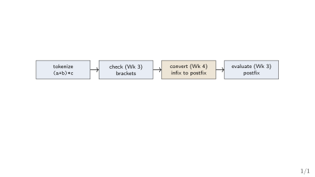
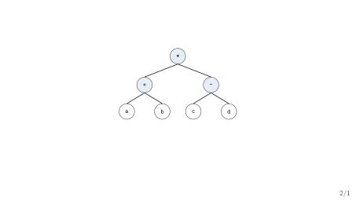
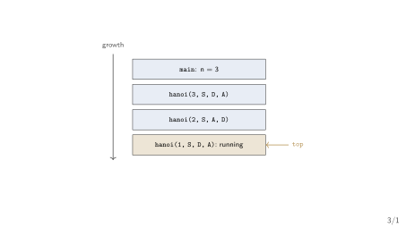
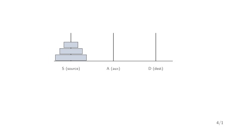

## Today's Four Questions

1. Why is `a+b*c` hard to evaluate as written?
2. How does one stack turn infix into postfix or prefix?
3. How does one stack turn prefix back into postfix?
4. Why does moving 64 disks take longer than the age of the universe?

::: {.highlightbox}
**Plan.** Name the three notations. Convert between them with a stack. Then let functions call themselves, and price what that costs.
:::

## Handoff: What Week 3 Finished

- Week 3 gave us the Stack ADT (`push`/`pop`/`peek`, `top` with $-1$ = empty, each $O(1)$ worst case) over an array.
- It applied one stack to two jobs: checking brackets (Lab P1) and *evaluating* a postfix string *already in postfix* (Lab P2).
- What it never did: produce that postfix string from what humans actually write.

::: {.highlightbox}
**This week's job.** Take `a+b*(c-d)/e` as typed, rewrite it for the stack, then study the stack that rewrites function calls: recursion.
:::

## The Calculator Pipeline

{fig-align="center"}

- Weeks 1--3 built stages 1, 2, and 4; the missing stage is the rewrite in the middle.
- Recursion (second half today) explains how stage 4's evaluator and every function call actually run.

[One program learning new tricks each week --- the course thread.]{.neutral}

## Where This Week Sits

- Week 2 priced things: name the operation, give the bound, state the case. Every claim today repeats that shape.
- Week 3's close promised: "from postfix to prefix and back, Hanoi, and recursion with the runtime stack."
- Week 5 (queues) then reuses the same conversion discipline for buffering; Week 11 returns with expression trees.

[The arc again: state the contract, implement it once, analyse what it costs.]{.neutral}

## {.transition-slide}

First: why what you type is not what the machine wants.

## {.section-divider}

::: {.section-divider-label}
Section 1
:::

::: {.section-divider-title}
Three Ways to Write Arithmetic
:::

## Why Infix Is Hard to Evaluate

- In `a+b*c`, the `+` comes first but runs second --- position lies about order.
- In `a-b-c`, the same symbol twice needs a tie-break: left to right gives $(a-b)-c$, right to left would give $a-(b-c)$.
- In `(a+b)*c`, brackets override everything --- the scanner must remember how deep it is.

::: {.highlightbox}
**The problem in one line.** Infix mixes three rules (precedence, associativity, parentheses); a single left-to-right scan cannot apply all three without remembering.
:::

## Infix, Postfix, Prefix

::: {.methodbox}
**Definitions (standard treatment; see Horowitz & Sahni Ch. 3)** [@HorowitzSahni2008_fundamentals_data_structures].

[**Infix**]{.hi-gold}: operator between operands (`a+b`). [**Postfix**]{.hi-gold}: operator after (`ab+`). [**Prefix**]{.hi-gold}: operator before (`+ab`). Postfix and prefix need no parentheses or precedence rules --- position alone fixes the order.
:::

- Same computation, three spellings: `(a+b)*c` = `ab+c*` = `*+abc`.
- Week 3 evaluated the middle spelling; today we produce all three from the first.

## Precedence and Associativity

| operators | precedence | associativity |
|---|---|---|
| `( )` | highest (override) | --- |
| `^` (power) | high | right: $a^{b^{c}} = a^{(b^{c})}$ |
| `* /` | medium | left: $a/b*c = (a/b)*c$ |
| `+ -` | low | left: $a-b-c = (a-b)-c$ |

- [**Precedence**]{.hi-gold} decides `*` before `+`; [**associativity**]{.hi-gold} breaks ties among equals.
- C, Java, and the syllabus all use this table --- memorise it once.

## Worked Mini-Example

::: {.methodbox}
**Same operands, different spellings.** `a+b*c` means $a + (b \times c)$: postfix `abc*+`. `(a+b)*c` means $(a + b) \times c$: postfix `ab+c*`.
:::

- The brackets move no operand --- they only redirect which operator waits on the stack.
- That redirection is the whole conversion algorithm of the next section.

[Trace both with the Week 3 evaluator to confirm: same stack code, different strings in.]{.neutral}

## Check Your Prediction

::: {.methodbox}
**Which postfix matches `a*b+c`?** A: `abc+*` \quad B: `ab*c+` \quad C: `ab+*c`
:::

1. A --- addition first, since it is written last.
2. B --- multiplication first, by precedence.
3. C --- brackets are implied around `b+c`.

::: {.highlightbox}
**Turn and talk.** Why does precedence decide this before any stack is even mentioned?
:::

## {.transition-slide}

The rules are set. Now the stack that applies them.

## {.section-divider}

::: {.section-divider-label}
Section 2
:::

::: {.section-divider-title}
Infix to Postfix
:::

## Infix to Postfix with One Stack (Lab P3)

::: {.methodbox}
**Algorithm (Karumanchi Ch. 4, pp.163--204 PDF)** [@Karumanchi2017_data_structures_algorithms_made_easy].

```
for each token t in the infix string, left to right:
    operand: append to output
    '(': push it
    ')': pop to output until '(' (discard both parens)
    operator op: while top is an operator of >= precedence
        (strictly > if op is right-associative): pop to output
        then push op
at the end: pop everything to output
```
:::

- Operands never touch the stack; only operators wait there.

## Worked Trace: `a+b*c-(d+e/f)`

| token | output so far | stack after step |
|---|---|---|
| `a` | `a` | empty |
| `+` | `a` | `+` |
| `b` | `a b` | `+` |
| `*` | `a b` | `+ *` |
| `c` | `a b c` | `+ *` |
| `-` | `a b c * +` | `-` |
| `(` | `a b c * +` | `- (` |
| `d` | `a b c * + d` | `- (` |
| `+` | `a b c * + d` | `- ( +` |
| `e` | `a b c * + d e` | `- ( +` |
| `/` | `a b c * + d e` | `- ( + /` |
| `f` | `a b c * + d e f` | `- ( + /` |
| `)` | `a b c * + d e f / +` | `-` |
| end | `a b c * + d e f / + -` | empty |

[Watch `-`: it flushes `+ *` first, since both outrank or tie it left-associatively.]{.neutral}

## Two Traps: Powers and Parentheses

- [Power is right-associative]{.negative}: $a^{b^{c}}$ is $a^{(b^{c})}$, so a second `^` must *not* pop the first --- pop only on strictly greater precedence.
- [Parentheses are not output]{.negative}: `(` marks "stop here" on the stack; `)` flushes to it and both parens are discarded.
- [Subtraction order]{.negative}: `a-b` pops as "pop `b` first, `a` second" at evaluation --- the Week 3 rule, unchanged.

::: {.highlightbox}
**Cost.** One pass, each token pushed and popped at most once: $O(n)$ time worst case, $O(n)$ auxiliary space worst case for $n$ tokens.
:::

## Check Your Prediction

::: {.methodbox}
**Convert `(a+b)*c-d`. What is the postfix?** A: `ab+cd-*` \quad B: `ab+c*d-` \quad C: `abc*+d-`
:::

1. A --- the `-` binds tighter than `*`.
2. B --- brackets first, then `*`, then `-`.
3. C --- precedence beats the brackets.

[Run the algorithm line by line; the `)` flushes exactly one `+`.]{.neutral}

## {.transition-slide}

Postfix done. Now the mirror image: prefix.

## {.section-divider}

::: {.section-divider-label}
Section 3
:::

::: {.section-divider-title}
Prefix and Back Again
:::

## Infix to Prefix by Reversal (Lab P3)

::: {.methodbox}
**Method.**

```
1. Reverse the infix string; swap '(' with ')'.
2. Run the postfix algorithm, treating all
   operators as usual BUT popping only on
   strictly greater precedence (mirror rule).
3. Reverse the result.
```
:::

- Why it works: prefix of $E$ is the mirror of postfix of $E$ reversed --- one algorithm serves both directions.
- The paren swap is the step everyone forgets; without it every bracket binds backwards.

## Worked Example: `a*(b+c)-d` to Prefix

- Reverse and swap parens: `d-(c+b)*a`.
- Postfix of the reversed string: `d c b + a * -` (the `)` flushes the `+` exactly as before).
- Reverse back: `-*a+bcd`.

::: {.highlightbox}
**Sanity check.** Read `-*a+bcd` outside-in: subtract $d$ from $\times(a, +(b,c))$ --- that is $a \times (b+c) - d$. Correct.
:::

[Fresh instance, same method as the previous section --- no new machinery.]{.neutral}

## Prefix to Postfix with One Stack (Lab P4)

::: {.methodbox}
**Algorithm: scan right to left.**

```
for each token t from right to left:
    if t is an operand: push(t as a string)
    if t is an operator op:
        a = pop(); b = pop()
        push(a + " " + b + " " + op)
at the end: the stack holds the postfix string
```
:::

- Direction matters: right-to-left meets operands before the operator that combines them.
- Trace `*+ab-cd`: `d`, `c` $\to$ `cd-`; `b`, `a` $\to$ `ab+`; `*` $\to$ `ab+cd-*`.

## A Peek at Expression Trees (Week 11)

{fig-align="center"}

- Operators are branch nodes, operands are leaves; postfix is post-order, prefix is pre-order.
- Full story in Week 11 --- for now, one picture to file away.

## Check Your Prediction

::: {.methodbox}
**Prefix `-+ab+cd` to postfix: first operator resolved?** A: `ab+` \quad B: `cd+` \quad C: `ab+cd+-`
:::

1. `ab+` --- the leftmost operator resolves first.
2. `cd+` --- scanning right-to-left meets `d`, `c` under the rightmost `+` first.
3. The whole string at once --- operators wait for both operands.

[Right-to-left: `d`, `c` combine under the rightmost `+` before anything else happens.]{.neutral}

## {.transition-slide}

Rewriting done. Now functions that call themselves.

## {.section-divider}

::: {.section-divider-label}
Section 4
:::

::: {.section-divider-title}
Recursion and Tower of Hanoi
:::

## What Recursion Is

::: {.methodbox}
**Definition (Karumanchi Ch. 2, pp.62--73 PDF; Wirth Ch. 3)** [@Karumanchi2017_data_structures_algorithms_made_easy; @Wirth2004_algorithms_data_structures].

A recursive function solves a smaller instance of its own problem: one [**base case**]{.hi-gold} answered directly, one [**recursive case**]{.hi-gold} that calls itself on strictly smaller input.
:::

```c
int fact(int n) {
    if (n <= 1) return 1;        /* base case */
    return n * fact(n - 1);      /* smaller instance */
}
```

- No base case: infinite descent. Input not shrinking: the same fate.

## Recursion vs. Iteration

- [**Iteration**]{.hi-gold} keeps one frame and updates variables --- constant stack space, always explicit about progress.
- [**Recursion**]{.hi-gold} spends one frame per level --- the call chain *is* the progress record, at $O(d)$ auxiliary space for depth $d$.
- Prefer recursion when the problem is self-similar (Hanoi, tree walks); prefer iteration when depth is large and the loop is simple (Wirth Ch. 3: when recursion does *not* help).

[Same power, different ledger: recursion bills the runtime stack.]{.neutral}

## The Runtime Stack: Frames

{fig-align="center"}

- Each call pushes a [**frame**]{.hi-gold} (locals, return address); return pops it. Week 1's orientation: stack grows down, heap grows up.
- Depth $d$ means $d$ frames alive --- Hanoi's depth is only $n$, but its calls number $2^{n}$.

## Tower of Hanoi: Rules

{fig-align="center"}

- Move the whole tower S $\to$ D; move one disk at a time; never place a larger disk on a smaller one.
- Three disks need 7 moves; $n$ disks need $2^{n} - 1$ (proved two slides on).

## Hanoi: the Recursive Idea

::: {.methodbox}
**Algorithm.**

```
hanoi(n, src, dst, aux):
    if n == 1: move disk src -> dst
    else:
        hanoi(n-1, src, aux, dst)   /* park n-1 out of the way */
        move disk src -> dst        /* free the largest disk */
        hanoi(n-1, aux, dst, src)   /* stack the n-1 on top */
```
:::

- The base case moves one disk; the recursive case reduces $n$ to $n - 1$ twice --- self-similarity made visible.
- Each "move disk" line is one counted step for the analysis next.

## Trace: Three Disks, Seven Moves

| move | disk | from $\to$ to |
|---|---|---|
| 1 | smallest | S $\to$ D |
| 2 | middle | S $\to$ A |
| 3 | smallest | D $\to$ A |
| 4 | largest | S $\to$ D |
| 5 | smallest | A $\to$ S |
| 6 | middle | A $\to$ D |
| 7 | smallest | S $\to$ D |

- Moves 1--3 park two disks on A; move 4 frees the largest; moves 5--7 restack on D --- the algorithm above, executed.

## Pricing Hanoi: $T(n) = 2T(n-1) + 1$

::: {.methodbox}
**Recurrence (count disk moves; Week 2 vocabulary).** $T(1) = 1$; for $n > 1$, $T(n) = 2T(n-1) + 1$ (two sub-towers plus the largest disk's move).
:::

- Unfold: $T(n) = 2^{k}T(n-k) + (2^{k} - 1)$; at $k = n - 1$, $T(n) = 2^{n-1} \cdot 1 + (2^{n-1} - 1) = 2^{n} - 1$.
- Hence $T(n) = 2^{n} - 1 = \Theta(2^{n})$ --- worst, best, and average coincide (only one move sequence exists).

[Doubling the disks squares the work only in legend --- it multiplies the moves by roughly two per added disk, and $2^{64} - 1$ outlives us all.]{.hi-gold}

## What Recursion Bills You

- [Depth overflow]{.negative}: $n = 100{,}000$ recursive frames burst the runtime stack --- iterate instead.
- [Repeated subproblems]{.negative}: naive recursive Fibonacci recomputes the same values exponentially often (iteration or memoisation wins).
- [Missing base case]{.negative}: the stack fills until the program crashes --- the use-after-free of control flow.

::: {.highlightbox}
**The habit (Week 2 shape).** Name the operation (moves, frames), give the bound ($\Theta(2^{n})$ moves, $O(n)$ frames), state the case.
:::

## Check Your Prediction

::: {.methodbox}
**Hanoi with $n = 4$ needs how many moves? Deep how many frames?** A: 8 moves, 4 frames \quad B: 15 moves, 4 frames \quad C: 16 moves, 16 frames
:::

1. A --- each disk doubles the moves exactly.
2. B --- $2^{4} - 1$ moves; depth never exceeds $n$.
3. C --- moves and depth grow together.

[Depth is the longest chain alive; moves count every call ever made.]{.neutral}

## {.transition-slide}

Conversion done, recursion priced. Now keep what matters.

## Three Common Mistakes

- [Popping `^` on a tie]{.negative} --- right-associative means strictly-greater pops only; $a^{b^{c}}$ is not $(a^{b})^{c}$.
- [Forgetting the paren swap on reversal]{.negative} --- infix-to-prefix without swapping binds every bracket backwards.
- [No base case, or input that never shrinks]{.negative} --- Hanoi with `n-1` missing recurses until the stack bursts.

::: {.highlightbox}
**The habit.** Trace the stack (operators, frames) line by line --- never from memory of the shape.
:::

## Week 4 Summary

- [**Notations**]{.hi-gold}: infix for humans; postfix/prefix need no parens.
- [**Conversions**]{.hi-gold}: infix$\to$postfix (one left-to-right stack pass); infix$\to$prefix (reverse--swap--postfix--reverse); prefix$\to$postfix (right-to-left stack of strings) --- all $O(n)$.
- [**Recursion**]{.hi-gold}: base + shrinking self-call; frames on the runtime stack, $O(d)$ space for depth $d$.
- [**Hanoi**]{.hi-gold}: $T(n) = 2T(n-1) + 1 = 2^{n} - 1 = \Theta(2^{n})$; depth only $n$.

::: {.highlightbox}
**Next week.** Queues: what changes when the first element out is the first one in --- circular buffers, deques, and priority.
:::

## Before You Go: Predict

::: {.methodbox}
**Three one-line predictions.** Answer from the algorithms, then check in the lab (P3, P4).
:::

1. Postfix of `(a-b)*(c+d)`?
2. Prefix of `a+b*c`?
3. Moves and max live frames for Hanoi $n = 5$?

[Answers: `ab-cd+*`; `+a*bc`; $31$ moves, $5$ frames.]{.neutral}

## References

::: {#refs}
:::
