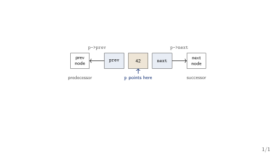
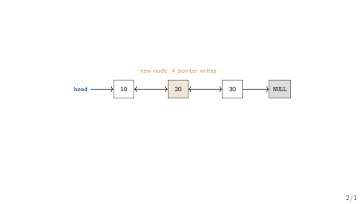
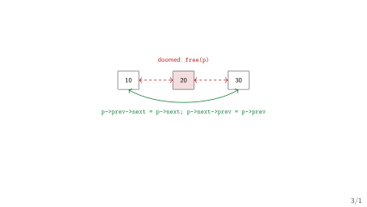
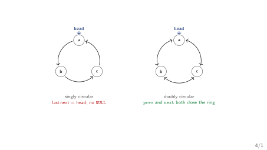
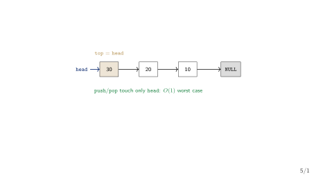
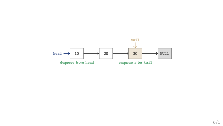
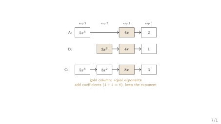

## Today's Four Questions

1. What does a backward link (`p->prev`) buy that one link cannot?
2. When a chain has no `NULL`, where does a walk stop?
3. Can the *same* stack and queue contracts run on chains instead of arrays?
4. Why does $5x^{100} + 3x^{2} + 1$ want three nodes, not 101 array slots?

::: {.highlightbox}
**Plan.** Price the backward link. Meet the ring. Re-implement the stack and queue on chains. Then spend linked lists on the syllabus's polynomial.
:::

## Handoff: What Week 6 Left Open

- Week 6 built the singly linked list: a node is data plus one link, `head` is the sole entry, `NULL` terminates the chain. Front-insert is $O(1)$ worst case; end-insert, delete, and search are $O(n)$ worst case; the three-pointer reverse runs in $O(n)$ time and $O(1)$ space.
- It closed on one promise: "what does a backward link buy?" --- and named Week 7 as doubly/circular lists, list-based stack and queue, and polynomials.
- The deficiency it left: *every* delete paid the walk, because to unlink a node we first had to find its predecessor.
- New symbols today: `p->prev` (predecessor link), `tail` (a queue's last-node handle), and circular-list conventions (`last->next == head`; no `NULL`).

::: {.highlightbox}
**This week's job.** Add a second link so a node knows both neighbours, close the chain into a ring when it has no end, run the stack and queue on nodes instead of slots, and store polynomials that are mostly zeros.
:::

## The Calculator Needs a Backward Link

- The expression processor's symbol table is a linked list of identifiers (Week 6). When a block scope exits, the compiler must delete every identifier declared in it --- and it already holds a pointer to each one, not to its predecessor.
- Singly, "delete by pointer" still costs a walk to find the node whose `next` points at the target: $O(n)$ worst case. We are re-finding information we already had.
- The same need recurs everywhere: text-editor undo/redo, browser back/forward, OS free-lists of memory blocks, LRU caches.

::: {.highlightbox}
**The pattern (design principle).** Every structure answers a deficiency the previous one just exhibited. Week 6's singly list had no backward walk --- the doubly linked list is the fix.
:::

## {.transition-slide}

One link looked forward. This week's first question: what does a second link add?

## {.section-divider}

::: {.section-divider-label}
Section 1
:::

::: {.section-divider-title}
Doubly Linked Lists
:::

## The Node That Looks Both Ways

- A user clicks *delete* on a bookmark; the program holds a pointer straight to that node. Singly, the only way to unlink it is to find the node whose `next` points at it --- a full walk, $O(n)$ worst case. The work is avoidable: at deletion we can already reach the node, so we should reach its neighbours too.
- The fix costs exactly one extra pointer per node: store the predecessor as well as the successor.

::: {.methodbox}
**Definition (Karumanchi Ch. 3, pp.74--162 PDF; Wirth Sec. 4.3, p. 115)** [@Karumanchi2017_data_structures_algorithms_made_easy; @Wirth2004_algorithms_data_structures]

A [**doubly linked list**]{.hi-gold} (DLL) is a chain of nodes, each holding data plus *two* links: `next` to the successor and `prev` to the predecessor. `head` points to the first node; the first node's `prev` is `NULL` and the last node's `next` is `NULL`.
:::

```c
struct node { int data; struct node *prev; struct node *next; };
```

- Worked example: building `[10] <-> [20] <-> [30]`, each `<->` is two links, drawn next. The bill: one extra pointer per node, and every insert/delete must repair *two* links instead of one.

## A Doubly-Linked Node, Drawn

{fig-align="center"}

- One node now offers *two* constant-time moves: forward through `p->next`, backward through `p->prev`. That is all the second link does --- and all the delete fix needs.

## Insert at the Front, End, and After a Node

::: {.methodbox}
**Pointer surgery: insert `x` after a given node `p` (Karumanchi Ch. 3, pp.74--162 PDF)**

```c
newNode = malloc(sizeof(struct node)); newNode->data = x
newNode->next = p->next                 // 1. wire forward
newNode->prev = p                       // 2. wire backward
if (p->next != NULL) p->next->prev = newNode  // 3. fix old successor
p->next = newNode                       // 4. splice in
```
:::

- Front-insert and end-insert are special cases: front-insert sets `newNode->prev = NULL` and moves `head`; end-insert is "after the old last node."
- [**The two-link invariant**]{.hi-gold}: after any operation, every interior node satisfies `p->next->prev == p` and `p->prev->next == p`. Steps 3 and 4 are what keep it.

## Pointer Surgery: Insert After `p`, Drawn

{fig-align="center"}

- `X->next = B`, `X->prev = A`, then `B->prev = X` and `A->next = X`. The old `A <-> B` link is overwritten --- wire the new node before repointing its neighbours.

## Delete by Pointer: The $O(1)$ Bypass

::: {.methodbox}
**Delete the node `p` points at (Karumanchi Ch. 3, pp.74--162 PDF)**

```c
if (p->prev != NULL) p->prev->next = p->next
else head = p->next                 // p was the first node
if (p->next != NULL) p->next->prev = p->prev
free(p)                             // reclaim exactly once
```
:::

- [**Socratic pause**]{.hi-gold}: with only `p` in hand, which two nodes must learn the new link --- and how does each find its neighbour without a walk?
- The answer is the whole payoff: they are `p->prev` and `p->next`, both reachable in $O(1)$. So delete is $O(1)$ worst case once `p` is known --- against Week 6's $O(n)$.

## Delete the Middle, Drawn

{fig-align="center"}

- The two dashed links die; one bypass (green) replaces them: 10's `next` jumps to 30 and 30's `prev` jumps to 10. Then `free(p)`.

## The Two-Link Invariant, and the Full Price List

::: {.methodbox}
**Invariant (Wirth Sec. 4.3, p. 115; standard treatment)**

For every node `p` that is not an endpoint: `p->next->prev == p` and `p->prev->next == p`. Every operation must restore this before it returns.
:::

| operation | bound | note |
|---|---|---|
| insert at front | $O(1)$ worst case | 2 writes; order matters |
| insert after given `p` | $O(1)$ worst case | given pointer skips the walk |
| delete given `p` | $O(1)$ worst case | [**the backward link's payoff**]{.hi-gold} |
| insert/delete by value | $O(n)$ worst case | the search dominates |
| search | $O(n)$ worst / $O(1)$ best | unordered; `prev` does not help |
| display forward / backward | $\Theta(n)$ | must visit all $n$ |
| reverse | $O(n)$ worst, $O(1)$ space | one flip + one `prev` fix per node |

[Search is unchanged: $O(n)$ worst case, $O(1)$ best case --- the backward link does not help an unordered search. `displayBwd` needs a `tail` handle; reverse is Week 6's flip plus one `prev` fix per node.]{.neutral}

## {.transition-slide}

One link each --- now both ways. Next: chains with no end at all.

## {.section-divider}

::: {.section-divider-label}
Section 2
:::

::: {.section-divider-title}
Circular Linked Lists
:::

## A Ring With No End

- A round-robin scheduler hands the CPU to each process in turn, then returns to the first. A repeating playlist does the same; so does a token-ring network. The last element is followed by the first --- there is no natural end.
- A chain that models this should make the last node point back to the first, instead of to `NULL`.

::: {.methodbox}
**Definition (Karumanchi Ch. 3, pp.74--162 PDF)** [@Karumanchi2017_data_structures_algorithms_made_easy]

A [**circular linked list**]{.hi-gold} is a chain whose last node's `next` points back to `head` instead of `NULL`. In a [**singly circular**]{.hi-gold} list each node has one link; in a [**doubly circular**]{.hi-gold} list `prev` and `next` both close the ring (`head->prev` is the last node). An empty circular list has `head == NULL`; a one-node circular list points to itself.
:::

## Singly and Doubly Circular, Drawn

{fig-align="center"}

## Traversal Without `NULL` --- and Where Rings Serve

::: {.methodbox}
**The termination rule (Karumanchi Ch. 3, pp.74--162 PDF)**

```c
p = head
if (p != NULL) do { visit p; p = p->next } while (p != head)
// stop when the walk RETURNS TO HEAD, not when it hits NULL
```
:::

- A `while (p != NULL)` loop on a circular list never meets `NULL`: it loops forever or crashes. The stop condition must name `head`. For the doubly circular ring, the same rule with `p->prev` walks the other way.
- Every operation that ends at the "last" node must handle wraparound; insert and delete must keep the ring closed (`head->prev` and `last->next`).
- Rings serve round-robin schedulers, repeating playlists, token-ring networks --- and the circular queue's modular index, which is the same idea seen as a linked ring.

## Check Your Prediction

::: {.methodbox}
**A singly circular list holds 4 nodes: `head` $\to$ a $\to$ b $\to$ c $\to$ d $\to$ a. You run `while (p != NULL) { p = p->next; }`. What happens?** A: visits a,b,c,d then stops \quad B: loops forever \quad C: stops after one node
:::

1. A --- only if some `next` were `NULL`; in a ring none is.
2. B --- no node ever holds `NULL`, so the test never fires; the walk cycles a,b,c,d, a,b,c,d, ...
3. C --- the loop condition is checked every hop, not once.

[Correct: B. The fix is to test `p != head` (or to visit with a do--while so the first node is not skipped).]{.neutral}

## {.transition-slide}

The chain has come full circle. Now reuse the contracts we already own.

## {.section-divider}

::: {.section-divider-label}
Section 3
:::

::: {.section-divider-title}
Stack and Queue, Reborn on Chains
:::

## List-Based Stack: Push and Pop at the Head

[One ADT, implemented twice: the same Week 3 stack contract, now on chains.]{.neutral}

::: {.methodbox}
**Stack over a linked list (Karumanchi Ch. 4, pp.163--204 PDF; Sedgewick Sec. 1.3, p. 120)** [@Karumanchi2017_data_structures_algorithms_made_easy; @Sedgewick2011_algorithms]

```c
push(x): newNode = malloc(...); newNode->data = x
         newNode->next = head; head = newNode      // O(1) worst
pop():   if (head == NULL) error                  // stack underflow
         temp = head; head = head->next
         x = temp->data; free(temp); return x      // O(1) worst
```
:::

- The top of the stack is `head`. This is exactly Week 6's front-insert plus front-delete --- both rewrite one link, so both are $O(1)$ worst case.
- The array version was also $O(1)$; the list's win is unbounded size and no amortized reallocation. Cost: $O(n)$ space for $n$ items, one node each.

## A List-Based Stack, Drawn

{fig-align="center"}

- After `push(40)`, `head` points at the new 40-node and its `next` is the old top (30). `pop` reverses exactly that.

## List-Based Queue: Keep a Tail Pointer

::: {.methodbox}
**Queue over a linked list (Karumanchi Ch. 5, pp.205--223 PDF; Sedgewick Sec. 1.3, p. 120)** [@Karumanchi2017_data_structures_algorithms_made_easy; @Sedgewick2011_algorithms]

```c
enqueue(x):
  newNode = malloc(...); newNode->data = x
  newNode->next = NULL
  if (head == NULL) head = tail = newNode
  else tail->next = newNode; tail = newNode    // O(1)
dequeue(): if (head == NULL) error      // underflow
           temp = head; head = head->next
           if (head == NULL) tail = NULL
           x = temp->data; free(temp); return x
```
:::

- `tail` makes end-insert $O(1)$; dequeue is at `head` --- both ends $O(1)$ worst case, unlike a fixed array.

## A List-Based Queue, Drawn

{fig-align="center"}

- `head` is the oldest item (next to leave); `tail` is the newest. `enqueue` links after `tail` and advances it; `dequeue` unlinks `head`.

## Array vs. List for Stack and Queue: The Honest Bill

| operation | array | linked list |
|---|---|---|
| stack `push`/`pop` | $O(1)$ worst, fixed capacity$^{*}$ | $O(1)$ worst, unbounded |
| queue `enqueue`/`dequeue` | $O(1)$ worst (circular), fixed | $O(1)$ worst (`head`+`tail`), unbounded |
| memory | one block of $n$ slots | one node per item, +1 pointer each |
| locality | contiguous, cache-friendly | scattered, pointer-chasing |

- $^{*}$Stack reallocation is amortized $O(1)$ when it grows.
- No universal winner: choose the array when the size is known or bounded and locality matters; the list when the size is unpredictable and growth is frequent. The contract is identical --- only the cost profile moves.

[Circular-queue variant: keeping `tail->next == head` closes the ring, so one `tail` pointer gives round-robin `enqueue`/`dequeue` at $O(1)$ worst case --- no `count`, no sacrificed slot, no `mod` (Week 5's linked cousin).]{.neutral}

## {.transition-slide}

Stacks and queues reborn. One application left --- and it is the syllabus's polynomial.

## {.section-divider}

::: {.section-divider-label}
Section 4
:::

::: {.section-divider-title}
Polynomial Manipulation
:::

## Why Polynomials Want a List

- The polynomial $5x^{100} + 3x^{2} + 1$ has *three* nonzero terms but spans exponents 0 to 100. An array indexed by exponent needs 101 slots --- 98 of them holding zero.
- Sparse data --- mostly empty --- is exactly when a contiguous array wastes space. Storing only nonzero terms as $(\text{coefficient}, \text{exponent})$ nodes keeps three nodes.
- The calculator's evaluator can hold a polynomial expression as a chain, then add, subtract, or multiply two such chains term by term.
- The same deficiency pattern again: the array has a fixed span; the list stores only what actually exists.

## The Polynomial Node

::: {.methodbox}
**Definition (Horowitz & Sahni Ch. 4, standard treatment; Aho--Hopcroft--Ullman Ch. 2, standard treatment)** [@HorowitzSahni2008_fundamentals_data_structures; @AhoHopcroftUllman1983_data_structures_algorithms]

A polynomial $\sum_i a_i x^{e_i}$ is stored as a list of nodes, each holding a coefficient and an exponent, kept in [**strictly descending exponent order**]{.hi-gold} (the course convention):
:::

```c
struct pnode { float coeff; int exp; struct pnode *next; };
```

- The head handle is again `head`; the zero polynomial is `head == NULL`. Terms whose coefficient is $0$ are never stored --- that is the sparsity payoff.
- Example: $5x^{3} + 4x + 2$ is the chain `(5,3)` $\to$ `(4,1)` $\to$ `(2,0)` $\to$ `NULL`.

## Polynomial Addition: Merge by Descending Exponent

::: {.methodbox}
**Adding two ordered chains (Horowitz & Sahni Ch. 4, standard treatment)** [@HorowitzSahni2008_fundamentals_data_structures]

```
// A, B sorted by descending exp; build C
while (A != NULL && B != NULL):
    if   A->exp > B->exp: append copy of A; A = A->next
    elif B->exp > A->exp: append copy of B; B = B->next
    else: sum = A->coeff + B->coeff
          if (sum != 0) append node(sum, A->exp)
          A = A->next; B = B->next
append the rest of whichever list is not exhausted
```
:::

- The two ordered chains are merged like two sorted runs: one pass, one output node per surviving term. Cost $= O(n + m)$ worst case for $n, m$ terms in A, B.
- Appending to the output's tail is Week 6's end-insert; keeping an output `tail` pointer makes each append $O(1)$, so the whole merge is linear.

## Addition Alignment, Drawn

{fig-align="center"}

## Worked Example: Add Two Polynomials

| step | compare | action | C so far |
|---|---|---|---|
| 1 | $3$ vs. $2$ | A's exp larger | $5x^{3}$ |
| 2 | $1$ vs. $2$ | B's exp larger | $5x^{3} + 3x^{2}$ |
| 3 | $1$ vs. $1$ | equal: $4 + 4$ | $5x^{3} + 3x^{2} + 8x$ |
| 4 | $0$ vs. $0$ | equal: $2 + 1$ | $5x^{3} + 3x^{2} + 8x + 3$ |

- A $= 5x^{3} + 4x + 2$, B $= 3x^{2} + 4x + 1$. Read the compare column: at each step the larger exponent is copied through; equal exponents are added.
- No term is dropped and no zero term is stored. A cancellation (say $4x + (-4x)$) would append *nothing* --- the sparsity discipline in action.
- [**Multiplication**]{.hi-gold} repeats the idea: each term of A times every term of B (coefficients multiply, exponents add), then merge equal exponents --- $O(n \cdot m)$ worst case.
- [**Verdict**]{.hi-gold}: the array wins on a small, dense exponent range ($O(1)$ term lookup by exponent); the list wins on a sparse, high-degree polynomial. State the workload, then choose.

## {.transition-slide}

Two weeks of chains. Now the map that holds Unit II together.

## Unit II in One Map (Class Test 2)

| week | contract | load-bearing skill |
|---|---|---|
| 6 | singly list: `head`, `p->next`, `NULL` | pointer surgery; three-pointer reverse |
| 7 | DLL `p->prev`; rings; list stack/queue; polynomials | two-link invariant; ring termination; ADT reuse; merge |

- The decision array-vs-list is now a full comparison, not "lists are better": positional reads favour the array; anywhere-edits and unpredictable size favour the chain.
- The test rewards traces: draw the chain, move the pointers, then name the operation, the bound, and the case.

## Three Classic Mistakes

- [Forgetting half the invariant]{.negative} --- updating `p->next` but not `p->next->prev` (or the reverse). The two links silently disagree, and a later backward walk corrupts or skips nodes.
- [Waiting for `NULL` in a ring]{.negative} --- `while (p != NULL)` on a circular list never terminates. The stop condition must name `head`.
- [Ignoring the endpoints]{.negative} --- forgetting to move `head` (or clear `tail`) when the first/last node leaves, or reusing a pointer after `free`. Week 1's dangling pointer and leak, now wearing list clothing.

::: {.highlightbox}
**How to revise.** Re-trace insert-after and delete-by-pointer with a covered answer column, then trace one polynomial addition. The test is traces, not definitions.
:::

## Week 7 Summary

- [**Doubly linked list**]{.hi-gold}: node $=$ data $+$ `prev` $+$ `next`; delete and insert by a known pointer are $O(1)$ worst case, paid for with an extra pointer per node and a two-link invariant to maintain.
- [**Circular list**]{.hi-gold}: `last->next == head`, no `NULL`; traversal stops at `head`; singly/doubly rings for round-robin use, and a linked circular queue over a ring.
- [**ADT reuse**]{.hi-gold}: the same Week 3 stack and Week 5 queue contracts run on chains, with $O(1)$ worst-case ends and unbounded size.
- [**Polynomials**]{.hi-gold}: ordered $(\text{coeff}, \text{exp})$ nodes; addition is a linear merge by descending exponent; lists win on sparse polynomials, arrays on dense ones.

::: {.highlightbox}
**Next week.** Searching --- linear versus binary, and the elementary sorts that put data in the order binary search needs.
:::

## Before You Go: Predict

::: {.methodbox}
**Three one-line predictions.** Answer from the algorithms, then check in the lab (P7).
:::

1. A DLL holds `head <-> 5 <-> 15 <-> 25`. Delete the node holding 15, given only a pointer to it: name the two links rewritten and the cost.
2. A singly circular list reads a $\to$ b $\to$ c $\to$ a. What are `a->next` and `c->next`, and what sentinel replaces `NULL`?
3. Add $(2x^{2} + 1)$ and $(-2x^{2} + 5x)$. Which terms survive, and why?

[Answers: 5's `next` $=$ 25 and 25's `prev` $=$ 5, then `free` the 15-node --- $O(1)$ worst case. `a->next` $=$ b, `c->next` $=$ a $=$ `head`; no `NULL`. Result $5x + 1$: the $x^{2}$ terms cancel to coefficient $0$ and a zero term is never stored.]{.neutral}

## References

::: {#refs}
:::
