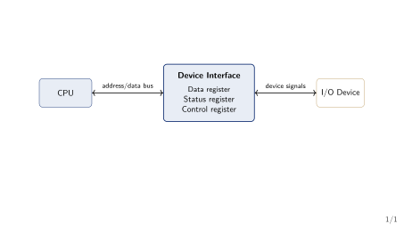
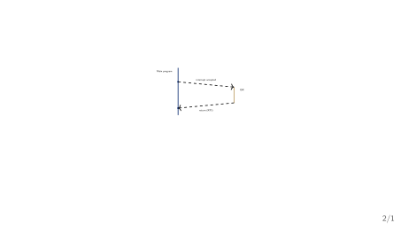
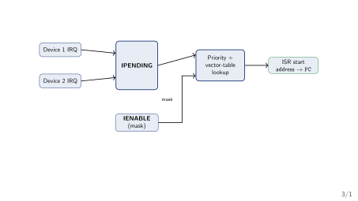
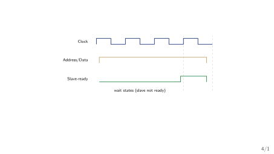
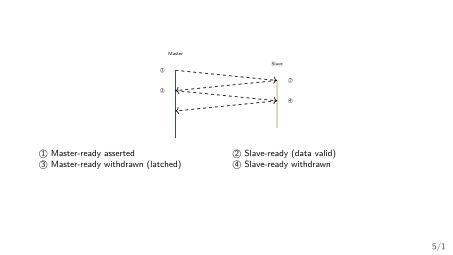
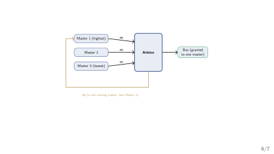
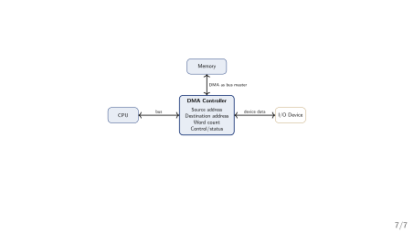

## Where We Left Off (Week 7)

::: {.methodbox}
**Last week: how the CPU controls *itself*.** Hardwired control (Week 6) and microprogrammed control (Week 7) both answered the same question: how does the CPU generate its own control-step sequence, cycle by cycle? Both designs looked *inward* --- registers, ALU, and an internal bus.
:::

::: {.highlightbox}
**The gap Week 7 left open.** Keyboards, disks, and printers are far slower than the CPU. How does the CPU get data from them --- and what does the *waiting* cost?
:::

## Roadmap: Four Questions, One Thread

1. [**Program-controlled I/O (polling)**]{.hi-gold} --- the CPU keeps asking "are you ready?" until the device says yes.
2. [**Interrupt-driven I/O**]{.hi-gold} --- the device asks the CPU instead.
3. [**Synchronous vs. asynchronous buses**]{.hi-gold} --- what "ready" looks like on the wires between CPU and device.
4. [**DMA and I/O processors**]{.hi-gold} --- removing the CPU from the data path entirely.

::: {.resultbox}
**Running thread for today.** One keyboard-input / display-output pair (`KIN`/`DOUT`) follows us through polling and interrupts; a 4096-byte disk block follows us through bus timing and into DMA/IOP.
:::

## {.transition-slide}

Before any technique: what is the problem they all solve?

## {.section-divider}

::: {.section-divider-label}
Section 2
:::

::: {.section-divider-title}
The I/O Problem and the I/O Unit
:::

## Socratic Question: The Speed Mismatch

::: {.methodbox}
**Question.** A CPU runs one instruction about every nanosecond ($10^9$ instructions per second). A keyboard produces one keystroke about every 200 milliseconds (about 5 keystrokes per second). If the CPU must read every keystroke, what should it do during the 200 ms between two keystrokes?
:::

- The CPU is roughly [**200 million times**]{.hi-gold} faster than the typist --- the two operate on completely different time scales.
- Waiting wastes the CPU, so I/O design is really the question: *who does the waiting*, and *what does the waiting cost*?
- Today's four techniques are four answers to that one question.

## The Simplest Way In: Memory-Mapped I/O

::: {.methodbox}
**Memory-mapped I/O.** A device's **data**, **status**, and **control** registers are given addresses in the *normal* memory space. The CPU reads and writes a device exactly like it reads and writes memory --- no special I/O instructions needed [@Hamacher2002_computer_organization].
:::

- The alternative --- [**isolated I/O**]{.hi-gold} --- needs separate I/O instructions and a separate address space (the classic IBM approach, Mano Ch. 11). Memory-mapped I/O is simpler for this course.

## The I/O Device Interface: Three Registers

{fig-align="center" width="70%"}

**What this diagram shows:** the CPU never talks to the device directly. It talks to three registers inside the device's interface, over the ordinary bus:

- [**Data register**]{.hi-gold} --- the byte actually being transferred (e.g. `KBD_DATA` for the keyboard, `DISP_DATA` for the display).
- [**Status register**]{.hi-gold} --- flags such as `KIN` (a keystroke is waiting) or `DOUT` (display is ready for the next character).
- [**Control register**]{.hi-gold} --- settings such as interrupt-enable bits.
- The interface also performs address decoding, timing, and format conversion --- the "six functions" of an interface circuit, Hamacher Ch. 7 §7.4, p. 238.

## Memory-Mapped vs. Isolated I/O: The Trade-off

::: {.smaller}
|  | **Memory-mapped I/O** | **Isolated I/O** |
|---|---|---|
| Address space | Devices share the memory space | Separate I/O space |
| Instructions | Ordinary `Load`/`Store` | Dedicated I/O instructions |
| Simplicity | Simpler for the programmer | Extra hardware/instructions |
| Typical use | Most modern processors | Classic IBM mainframes |
:::

We use memory-mapped I/O for the rest of the deck --- it is what the Hamacher examples assume [@Hamacher2002_computer_organization]. The isolated form is the standard alternative (Mano Ch. 11).

## {.transition-slide}

Technique 1: the CPU does all the asking --- polling.

## {.section-divider}

::: {.section-divider-label}
Section 3
:::

::: {.section-divider-title}
Program-Controlled I/O (Polling)
:::

## Definition: Program-Controlled I/O (Polling)

::: {.methodbox}
**Polling.** In **program-controlled I/O** (also called **polling**), the CPU runs a loop that repeatedly reads the device's *status register* and checks a ready flag. When the flag says the device is ready, the CPU stops the loop and performs the data transfer itself.
:::

- The device never initiates anything --- it only answers questions.
- Two new status flags, one per device direction: [**`KIN`**]{.hi-gold} (a keyboard keystroke is ready in `KBD_DATA`) and [**`DOUT`**]{.hi-gold} (the display is ready for the next character in `DISP_DATA`).

## Worked Example: Two Polling Loops

::: {.columns}
::: {.column width="48%"}
**Keyboard input**

Read one keystroke into register `R`.

::: {.methodbox}
**`READWAIT` loop**

```
READWAIT: Test KIN
          Branch=0 READWAIT
          MoveByte KBD_DATA, R
```
:::
:::

::: {.column width="48%"}
**Display output**

Send register `R` to the display.

::: {.methodbox}
**`WRITEWAIT` loop**

```
WRITEWAIT: Test DOUT
           Branch=0 WRITEWAIT
           MoveByte R, DISP_DATA
```
:::
:::
:::

**How to read these loops:**

- `Test KIN` reads the status flag; `Branch=0` jumps back while the flag is still `0` (not ready).
- Only when the flag turns `1` does the loop fall through to the single transfer instruction.
- Each pass runs the same two-test instructions again --- the CPU is spinning, doing no useful work between keystrokes [@Hamacher2002_computer_organization].

## Worked Example: The Cost of Polling, in Numbers

::: {.methodbox}
**The setup.** A 2 GHz CPU (one instruction every 0.5 ns) polls a keyboard that produces 5 keystrokes per second. Each poll takes one 2-instruction pass (about 1 ns). Between two keystrokes, how many polls run, and how much CPU time do they waste?
:::

- Gap between keystrokes: $1/5 = 0.2$ s $= 2\times10^8$ ns.
- Polls per gap: $2\times10^8$ ns $\div$ 1 ns/poll $= 2\times10^8$ [**polls wasted**]{.hi-gold} per keystroke.
- Fraction of CPU consumed by polling: $2\times10^8$ ns $\div$ $2\times10^8$ ns $= 1.0$ --- the CPU spends [**100%**]{.hi-gold} of its time waiting on this one keyboard.

[Moral: polling is trivially simple but hands the CPU over to the slowest device in the system.]{.neutral}

## Polling: Trade-offs

| **Advantage** | **Disadvantage** |
|---|---|
| No extra hardware needed | Wastes CPU time while waiting |
| Trivial to implement | CPU cannot do other work during the wait |
| Works for any device | Cost grows with device slowness |

::: {.methodbox}
**When polling is (and isn't) a good fit.** **Good fit:** one slow device and a CPU with nothing else to do. **Bad fit:** a fast device, or several devices --- the CPU spends its life asking questions instead of computing.
:::

## {.transition-slide}

Technique 2: what if the device asked the CPU, instead of the CPU asking the device?

## {.section-divider}

::: {.section-divider-label}
Section 4
:::

::: {.section-divider-title}
Interrupt-Driven I/O
:::

## Definition: Interrupt and Interrupt-Service Routine

{fig-align="center" width="60%"}

::: {.methodbox}
**Interrupt.** An **interrupt** is a signal from a device that suspends the CPU's current program and forces it to jump to a fixed handler --- the **interrupt-service routine (ISR)** --- which services the device. When the ISR finishes, the CPU resumes the original program exactly where it left off.
:::

- Unlike polling, the device now signals *once*, unprompted --- the direction of initiative reverses.
- [**Interrupt latency**]{.hi-gold}: the gap between the device's request and the CPU's jump --- time during which the device waits.
- [**Shadow registers**]{.hi-gold}: registers where the CPU saves state so the ISR can use them freely [@Hamacher2002_computer_organization].

## Enabling and Disabling Interrupts: Two Switches

::: {.methodbox}
**A request reaches the CPU only if *both* switches are on.**

- [**`IE`**]{.hi-gold} --- one interrupt-enable bit inside the processor status register (`PS`). When `IE`$=0$, the CPU ignores *every* interrupt request, from any device.
- A *per-device* interrupt-enable bit in that device's control register --- [**`KIRQ`**]{.hi-gold} for the keyboard, [**`DIRQ`**]{.hi-gold} for the display --- decides whether *this* device may request an interrupt at all.
:::

- Example: `KIRQ`$=1$ and `IE`$=1$ means a keystroke will interrupt; `IE`$=0$ means it waits.

## Worked Example: A 5-Step Interrupt Scenario

::: {.smaller}
**The story:** a keystroke arrives while the CPU is busy running a program. Here is exactly what happens, step by step.

1. The device sets its status flag (`KIN`$=1$) and, if its enable bit `KIRQ` is on, raises an interrupt-request line.
2. The CPU finishes its *current instruction* (never interrupting mid-instruction), then checks the master switch `PS.IE`.
3. If `IE`$=1$: the CPU saves `PC` (and any registers the ISR will overwrite) into shadow registers, disables further interrupts, and loads `PC` with the ISR's starting address.
4. The ISR services the device --- here, it reads `KBD_DATA` (which clears `KIN`) --- then executes a return-from-interrupt instruction.
5. Return-from-interrupt restores the saved `PC` and re-enables interrupts. The interrupted program resumes as if nothing happened [@Hamacher2002_computer_organization].
:::

[Notice what the CPU did *not* do: it did not poll. It went on computing until the device rang the bell.]{.neutral}

## Handling Multiple Devices: Who Interrupted?

::: {.methodbox}
**Two designs for answering "which device interrupted?"**

- **Polling the sources**: on any interrupt, the ISR checks each device's status flag in turn to find the one that rang --- simple, but the check order costs time proportional to the number of devices.
- **Vectored interrupts**: each device supplies a small identifying code; hardware uses it to index straight into an [**interrupt-vector table**]{.hi-gold} --- one ISR starting address per device --- and jumps directly there.
:::

- Trade-off: a little extra hardware (the table + lookup) buys [**constant-time dispatch**]{.hi-gold}, no matter how many devices [@Hamacher2002_computer_organization].
- [Quantified: 8 devices cost up to [**8 sequential checks**]{.hi-gold} under polling-the-sources, but exactly [**1 lookup**]{.hi-gold} under a vector table, regardless of device count.]{.neutral}

## Interrupt Nesting and Priority: Two Devices, One CPU

{fig-align="center" width="70%"}

**What this diagram shows:** `IPENDING` latches *which* devices currently want an interrupt; `IENABLE` decides *which of those* are allowed through; the priority encoder picks the highest-priority allowed one; the vector table gives its ISR address.

If the lower-priority device's request stays pending while the higher one is being serviced, it waits until interrupts are re-enabled --- or, with [**nesting**]{.hi-gold}, a higher-priority request can interrupt the ISR itself.

## Exceptions: The General Form of an Interrupt

::: {.methodbox}
**Exception.** An **exception** is any event that interrupts the normal flow of control --- an I/O interrupt, but also divide-by-zero, an illegal instruction, a page fault, or a timer tick. The interrupt mechanism is the same; only the *source* differs [@Hamacher2002_computer_organization; @PattersonHennessy2017_computer_organization_design].
:::

- Thinking of them together matters because the CPU handles them with the same jump-to-handler machinery: save state, service, restore.
- This is the bridge the next lectures will reuse: exceptions are how the OS gets control back from user programs.

## Worked Example: An Exception in Action

::: {.methodbox}
**The scenario.** A running program executes `DIV R1, R2, R3` where `R3` holds `0`. The divide-by-zero condition is not an I/O event --- but the CPU handles it with exactly the same machinery Act 3 already built.
:::

1. The ALU detects the divide-by-zero and raises a fixed internal exception signal --- no external device, no interrupt-request line needed.
2. The CPU finishes what it can of the current instruction, then forces a jump; unlike an ordinary interrupt, this jump is **not** gated by `PS.IE` --- exceptions cannot be masked.
3. `PC` and status are saved into shadow registers; `PC` loads the divide-by-zero handler's fixed address.
4. The handler runs (report the error, or hand control to the OS) --- the same save/service/restore shape as an ISR, just a different table entry.

Same machinery, different trigger: a page fault, an illegal opcode, and a timer tick all follow this identical path, each with its own starting address in step 3 [@Hamacher2002_computer_organization; @PattersonHennessy2017_computer_organization_design].

## Socratic Check: Simultaneous Interrupt Requests

::: {.resultbox}
**Question.** Device 1 (higher priority) and Device 2 both request an interrupt on the same cycle. Device 1's ISR is still running when Device 2's request would normally be granted. What happens?
:::

- If **nesting** is allowed and Device 2 outranks whatever priority level Device 1's ISR is running at, Device 2 can interrupt *that ISR* --- the same 5-step scenario applies recursively.
- If nesting is disabled (or Device 2 is lower priority), Device 2's request stays latched in `IPENDING` until Device 1's ISR re-enables interrupts.

## Polling vs. Interrupts: The Trade-off

::: {.smaller}
|  | **Polling** | **Interrupts** |
|---|---|---|
| Who initiates | CPU (asks repeatedly) | Device (signals once, when ready) |
| CPU cost while waiting | Wasted spin cycles | Zero --- CPU runs other code |
| Extra hardware | None | `IE`, per-device enables, vector table |
| Response latency | Depends on poll rate | Interrupt latency (usually smaller) |
| Best fit | One slow device, nothing else to do | Multiple/unpredictable devices |
:::

[**Same problem, opposite direction of initiative**]{.hi-gold} --- interrupts move the waiting cost from the CPU to the hardware that detects readiness.

## {.transition-slide}

One level down: what does "the device is ready" look like on the wires?

## {.section-divider}

::: {.section-divider-label}
Section 5
:::

::: {.section-divider-title}
Synchronous vs. Asynchronous Bus
:::

## Bus Structure: Master and Slave Roles

::: {.methodbox}
**One shared bus, many devices.** Every I/O interface from Act 1 hangs off a single shared **bus** --- address, data, and control lines that every device listens to. A **bus protocol** is the rulebook for how a **master** (the device driving a transfer, usually the CPU) and a **slave** (the device responding) coordinate one data transfer without colliding.
:::

- [**This Act's question**]{.hi-gold}: when the master says "take this data" or "give me that data," how does the slave say "not ready yet" or "here it is"?
- Two different answers: [**synchronous**]{.hi-gold} (everyone shares a clock) and [**asynchronous**]{.hi-gold} (an explicit handshake, no clock) [@Hamacher2002_computer_organization].
- [Running example for this Act: our 4096-byte disk block's controller is today's slave --- every timing diagram below is the CPU (master) and that disk interface negotiating one word of the transfer.]{.neutral}

## Definition: Synchronous Bus

{fig-align="center" width="65%"}

::: {.methodbox}
**Synchronous bus.** All devices share a common **bus clock**. The master places the address and data on the bus at a fixed clock edge; every slave samples the bus at the *same* edge, with no per-transfer negotiation.
:::

If our disk controller is slower than the clock, it holds `Slave-ready` low for extra clock cycles while the CPU simply waits, still synchronized to the shared clock [@Hamacher2002_computer_organization].

## Worked Example: How Many Wait States?

::: {.methodbox}
**The setup.** Our disk controller takes 100 ns to place a word on the bus. The synchronous bus clock runs at 500 MHz (one clock cycle $=2$ ns). How many wait-state cycles does the master insert for one word?
:::

- Clock cycle time: $1/500\text{MHz} = 2$ ns.
- Cycles needed to cover the disk's 100 ns response: $100 \div 2 = $ [**50**]{.hi-gold} clock cycles.
- One cycle is the "normal" data cycle, so the master inserts [**49 wait-state cycles**]{.hi-gold} --- the slave holds `Slave-ready` low for all 49 before the transfer completes.

[Compare with Act 2's polling cost ($2\times10^8$ wasted polls for one keystroke): a slow device is expensive under every technique --- the question is only *who* pays and *how much*.]{.neutral}

## Definition: Asynchronous Bus (Full Handshake)

{fig-align="center" width="40%"}

::: {.methodbox}
**Asynchronous bus.** No shared clock. Master and slave exchange explicit **Master-ready**/**Slave-ready** signals, each one changing only *in response to* the other --- a [**full handshake**]{.hi-gold}.
:::

::: {.smaller}
| | |
|---|---|
| ① Master-ready asserted | ② Slave-ready (data valid) |
| ③ Master-ready withdrawn (latched) | ④ Slave-ready withdrawn |
:::

Each step waits for the previous one, so [**bus skew**]{.hi-gold} (wires arriving at slightly different times) never causes a false sample, unlike a synchronous bus's single fixed clock edge [@Hamacher2002_computer_organization].

## Synchronous vs. Asynchronous: The Trade-off

::: {.smaller}
|  | **Synchronous** | **Asynchronous** |
|---|---|---|
| Timing reference | Shared bus clock | Explicit handshake, no clock |
| Slow-device handling | Extra wait-state clock cycles | Handshake simply takes longer |
| Skew sensitivity | Sensitive --- must beat clock period | Immune --- self-timed |
| Per-transfer overhead | Low (one clock edge) | Higher (two round trips) |
| Best fit | Devices of similar, known speed | Mixed-speed / unpredictable devices |
:::

[**Same coordination problem, opposite mechanism**]{.hi-gold} --- a shared clock everyone trusts, or an explicit conversation that trusts nothing.

## Socratic Check: Why Not Always Use Asynchronous?

::: {.resultbox}
**Question.** Asynchronous handshaking tolerates skew and adapts automatically to any device speed. Why do most high-speed processor buses use synchronous protocols instead?
:::

- Every asynchronous transfer pays *two full round-trip delays* (steps 1--2 and 3--4) --- for consistently fast devices this is pure overhead a synchronous bus does not pay.
- Synchronous buses only lose when a device is unusually slow (extra wait states) or the clock must shrink to accommodate skew --- exactly the trade-off the comparison table names.

## {.transition-slide}

Interrupts still cost one instruction per word transferred --- what if the CPU left the loop entirely?

## {.section-divider}

::: {.section-divider-label}
Section 6
:::

::: {.section-divider-title}
DMA and I/O Processors
:::

## The Cost Interrupts Still Pay

::: {.methodbox}
**Socratic question.** A disk transfer moves a 4096-byte block, one 4-byte word at a time. With interrupt-driven I/O, the ISR executes on *every* word: read status, read/write data, update a memory pointer, decrement a counter, return. What does this cost for one block?
:::

- Words per block: $4096 \div 4 = $ [**1024**]{.hi-gold} words.
- That means [**1024 ISR invocations**]{.hi-gold} for a single block transfer --- one interrupt per word.
- Interrupts removed the CPU's *waiting*, but not its *involvement in moving every byte*. The next step removes the CPU from the data path itself.

## Bus Arbitration: A Third Role for a Device

{fig-align="center" width="55%"}

Any device connected via `BR`/`BG` can become bus **master**, not just the CPU --- the arbiter grants the bus to exactly one requester, by priority, each time [@Hamacher2002_computer_organization]. Being bus master is how a device can talk to memory *directly* --- the key idea the next slide builds on.

## From Arbitration to Direct Memory Access

::: {.methodbox}
**The functional idea, stated plainly.** Once a device can become bus master, it can transfer data *directly to or from memory* --- no CPU instruction touches the data at all. The CPU is interrupted *once*, when the whole block finishes, not once per word.
:::

[This edition of Hamacher's text (Ch. 7, arbitration) describes exactly this mechanism but never names it "DMA" --- the term and its standard treatment below follow Stallings Ch. 8 [@Stallings2015_computer_organization], per the syllabus and `.claude/rules/textbook-grounding.md`.]{.neutral}

## Definition: Direct Memory Access (DMA)

::: {.methodbox}
**DMA (general/standard treatment --- Stallings Ch. 8).** A **DMA controller** is given a source/destination address and a word count by the CPU, then becomes bus master (via arbitration) and transfers the entire block directly to/from memory, interrupting the CPU only when the *block* --- not each word --- is complete [@Stallings2015_computer_organization].
:::

- [**Pro**]{.positive}: CPU cost drops from 1024 ISRs to "one setup, one completion interrupt" --- a constant cost regardless of block size.
- [**Con**]{.negative}: the DMA controller and CPU now compete for the same memory bus (**cycle stealing**); extra hardware required.

## The DMA Controller: What's Inside

{fig-align="center" width="75%"}

**What each register does:**

- [**Source / destination address**]{.hi-gold} --- where the data comes from and goes to (memory address and device, or vice versa).
- [**Word count**]{.hi-gold} --- how many words remain to transfer; decremented after every word.
- [**Control/status**]{.hi-gold} --- transfer direction, mode, and the "block done" flag that interrupts the CPU.
- The CPU writes all four registers once at setup; the DMA controller owns them from then on.

## How a DMA Transfer Runs: Step by Step

::: {.smaller}
**The story:** copy the 4096-byte block from the disk to memory. The CPU appears twice --- at setup and at completion --- and never touches the data itself.

1. **Setup:** the CPU writes the DMA controller's registers --- source address (disk), destination address (memory), word count (1024), and direction (read) [@Stallings2015_computer_organization].
2. **Request:** the DMA controller asks for the bus by asserting `BR` (bus request).
3. **Grant:** the arbiter answers with `BG` (bus grant); the DMA controller becomes bus master [@Hamacher2002_computer_organization].
4. **Transfer one word:** the DMA controller reads one word from the device and writes it to memory (or the reverse), using one or two bus cycles.
5. **Decrement:** it subtracts 1 from the word count and, if the count is still $>0$, returns to step 2 for the next word.
6. **Done:** when the count reaches 0, the DMA controller drops `BR` and raises a *completion interrupt* --- the CPU's only involvement after setup.
:::

Compare with polling/interrupts: the CPU now appears exactly twice, at the start and the end.

## DMA Transfer Modes: Three Ways to Use the Bus

::: {.methodbox}
**How long does the DMA controller keep the bus?**

- [**Burst (block) mode**]{.hi-gold}: holds the bus for the *entire* block --- all 1024 words in one continuous burst, then releases and interrupts the CPU.
- [**Cycle-stealing (single) mode**]{.hi-gold}: grabs the bus for *one word*, releases it, re-requests --- the CPU can use the bus between DMA words.
- [**Transparent (hidden) mode**]{.hi-gold}: transfers *only during CPU cycles that do not use the bus at all* --- the CPU never even notices the DMA happening.
:::

::: {.smaller}
|  | **Burst** | **Cycle stealing** | **Transparent** |
|---|---|---|---|
| Bus held | Whole block | One word | Only idle CPU cycles |
| Transfer speed | Fastest | Medium | Slowest |
| Effect on CPU | Starved for the block | Brief pauses per word | None |
:::

In short: burst = "whole job now, do not bother me"; cycle stealing = "one word, then back off"; transparent = "only when you're not looking."

## Worked Example: How Much CPU Does DMA Save?

::: {.methodbox}
**The comparison.** Same 4096-byte block as the interrupt example. Interrupt-driven I/O: 1024 ISRs. DMA: one setup + one completion interrupt. Suppose one ISR takes 200 CPU instructions; how many instructions does each technique spend?
:::

- Interrupts: $1024 \times 200 = $ [**204,800**]{.hi-gold} instructions.
- DMA: one setup + one completion ISR $\approx 400$ instructions --- roughly [**500$\times$ less**]{.hi-gold} CPU work.
- The CPU that used to spend its whole time servicing the disk can now run the user's program instead.

## Definition: I/O Processor (IOP)

::: {.methodbox}
**IOP (general/standard treatment --- Stallings Ch. 8).** An **I/O processor** generalizes DMA one step further: a dedicated processor, given a whole *channel program* (a short program describing several transfers, formats, and simple decisions), executes it independently --- interrupting the main CPU only when the entire program completes, not per block.
:::

- The difference is *how much decision-making is delegated* away from the CPU, not just how the data moves.

## Worked Example: A Channel Program for IOP

::: {.methodbox}
**The scenario.** A print job needs three things done in order: read a 4096-byte record from disk, convert it to the printer's character format, then send it to the printer --- and interrupt the CPU only when all three finish.
:::

1. **Setup:** the CPU writes a short *channel program* into memory --- three steps: `READ disk` $\to$ `buffer`, `CONVERT buffer` $\to$ `buffer2`, `WRITE buffer2` $\to$ `printer` --- then hands the IOP its starting address.
2. **Execution:** the IOP runs all three steps itself, becoming bus master as needed (exactly like DMA), with *no* CPU involvement between steps.
3. **Completion:** only after `WRITE` finishes does the IOP raise one interrupt --- the CPU never sees the intermediate `READ`/`CONVERT` steps at all.

Compare with DMA: DMA's "program" is always the same one step (copy this block); an IOP's channel program can chain several different operations --- exactly the extra delegation Stallings Ch. 8 describes [@Stallings2015_computer_organization].

## Four I/O Techniques, Head to Head

::: {.smallest}
|  | **Polling** | **Interrupts** | **DMA** | **IOP** |
|---|---|---|---|---|
| CPU cost / word | Every poll | Every word (ISR) | None (setup only) | None |
| CPU cost / block | --- | Thousands of ISRs | One interrupt | One interrupt |
| Extra hardware | None | Vector table, `IE` | DMA controller | Dedicated processor |
| Best fit | One slow device | Multiple/sporadic devices | Bulk block transfer | Complex I/O subsystems |
:::

[**Same core question, four answers**]{.hi-gold}: who watches the device, and how much of the CPU does watching cost?

## Socratic Check: Choosing a Technique

::: {.resultbox}
**Question.** A system reads one temperature sensor value per second (low rate, latency-tolerant) and separately copies a 10 MB file from disk to memory (high rate, throughput-critical). Which technique fits each?
:::

- Temperature sensor: [**interrupts**]{.hi-gold} --- rate is low, so ISR overhead per event is negligible, and the CPU is free the rest of the time.
- Disk copy: [**DMA**]{.hi-gold} --- per-word CPU involvement at that data rate would dominate CPU time; DMA reduces it to one setup, one completion interrupt.
- [Rule of thumb: match the technique to the *rate* and *size* of the transfer, not to habit.]{.neutral}

## {.section-divider}

::: {.section-divider-label}
Section 7
:::

::: {.section-divider-title}
Synthesis
:::

## {.transition-slide}

Four techniques, one trade-off. What's the pattern underneath?

## The Four Threads Meet

::: {.methodbox}
**Every design choice moves the waiting cost somewhere else.**

- **Polling vs. interrupts (programmer's view):** polling wastes CPU cycles asking (recall: $2\times10^8$ wasted polls for one keystroke); interrupts let the device ask instead, at the cost of vector-table/priority hardware.
- **Synchronous vs. asynchronous (bus hardware):** a shared clock is cheap per transfer but skew-sensitive (recall: 49 wait states for one slow disk word); a handshake is skew-immune but pays two round trips every time.
- **Interrupts vs. DMA/IOP (who moves the data):** interrupts still touch every word (recall: 204,800 instructions for one disk block); DMA and IOP remove the CPU from the data path, trading extra hardware for near-zero per-word cost ($\approx 400$ instructions for the same block).
:::

None of these is free --- exactly the pattern Weeks 5--7 established for buses and control units, now applied to the world outside the chip.

## Bridge to Week 9

::: {.highlightbox}
**From moving data to storing it efficiently.** Weeks 1--8 built a CPU that computes, controls itself, and now moves data to and from slow devices. Week 9 asks: once data is in memory, how do we make *memory itself* fast enough to keep up with the CPU?
:::

- DRAM is far slower than the CPU --- the same speed-mismatch problem this week solved for devices reappears for memory itself.
- Cache memory, mapping functions, and replacement policies are Week 9's answer.

## Summary

- [**Memory-mapped I/O**]{.hi-gold}: device registers (data/status/control) live in the normal address space; [**polling**]{.hi-gold} repeatedly tests a status flag (`KIN`, `DOUT`).
- [**Interrupts**]{.hi-gold}: the device signals readiness; `PS.IE` and per-device enables (`KIRQ`/`DIRQ`) gate delivery; [**vectored interrupts**]{.hi-gold} use `IPENDING`/`IENABLE` plus an interrupt-vector table for constant-time dispatch.
- [**Synchronous bus**]{.hi-gold}: shared clock, wait states for slow slaves. [**Asynchronous bus**]{.hi-gold}: `Master-ready`/`Slave-ready` full handshake, skew-immune but higher per-transfer overhead.
- [**Bus arbitration**]{.hi-gold} (`BR`/`BG`) lets a device become bus master --- the functional basis for [**DMA**]{.hi-gold} (block transfer, one completion interrupt) and [**IOP**]{.hi-gold} (whole channel programs, general/standard treatment per Stallings Ch. 8).
- [**Four techniques, one trade-off axis**]{.hi-gold}: how much of the CPU does watching and moving the data cost, and how much hardware buys that cost down.
- [Every number today was one bill for the same speed mismatch --- the techniques differ only in who pays it.]{.neutral}

## References

::: {#refs}
:::
