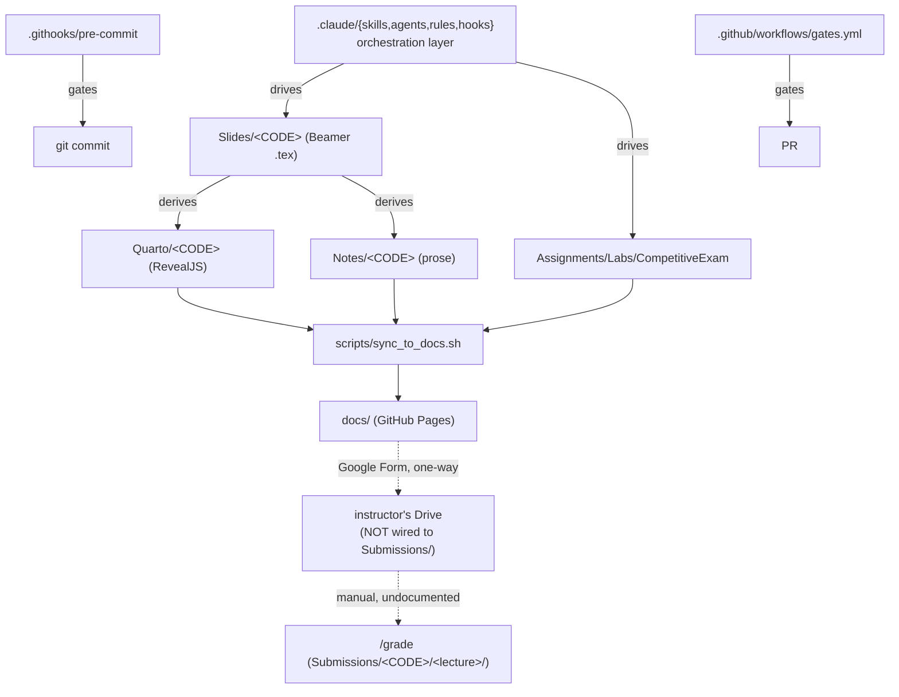

# Feature Discovery Report

**Target:** `D:\Academic-Workload\Academic-Skill` ("My Claude Code Setup" — forked from `pedrohcgs/claude-code-my-workflow`, now `AUQIB92/claude-code-my-workflow`)
**Mode:** Discovery (default) · **Date:** 2026-08-19
**Scope:** the repo as a software/tooling product — orchestration layer, CI/CD, docs pipeline, community-health files. Academic-content gaps (write more lecture weeks) are explicitly out of scope per `/feature-discovery`'s own boundary.

---

## 1. Executive Summary

This is a mature, unusually well-governed template: 72 skills / 23 agents / 39 rules / 7 hooks, a real fan-out→reduce→judge orchestration runtime, an enforced pre-commit + CI gate suite, and — rare for a repo this size — an actively maintained, explicit backlog (`.claude/references/v2.0-backlog.md`) that already names most of its own known gaps with cost estimates. The five-lens pass below didn't find a repo lacking direction; it found several **already-shipped features that don't quite connect to each other**, and a handful of **built-but-invisible or built-but-unenforced infrastructure**.

**Biggest strengths:** the gate/hook system is real (not aspirational), model-routing is 100% adopted at the agent tier, and the backlog discipline means very little here is undocumented ignorance — most gaps are known trade-offs, not blind spots.

**Biggest gaps, in order of how much they matter:**
1. **A fork-identity bug in the community-health files** — `SECURITY.md`, `CODE_OF_CONDUCT.md`, and `TROUBLESHOOTING.md` still point at the upstream author's repo/contact, not this fork's. A real security report on this fork would currently misroute.
2. **Two shipped features that don't talk to each other** — the new assignment-submission channel (Google Form) and the `/grade` pipeline's expected input format were built independently and have no bridge; grading also has no return channel to students.
3. **A hardcoded personal analytics ID** shipped into 9 published template pages, with no onboarding step telling a forker to swap it.
4. **Two pieces of real, working infrastructure nobody schedules or enforces** — `nightly-repro-check.sh` (no cron/CI trigger anywhere) and the fan-out round/spend caps (prose-only, no hook, unlike the git-guardrails precedent this repo already has for exactly this pattern).

**Recommended direction:** none of the above needs new capability — every fix reuses something that already exists (an existing script, an existing hook pattern, an existing doc convention). This is a "close the loop" phase, not a "build more" phase.

---

## 2. Repository Understanding

### Project Purpose
CONFIRMED (`CLAUDE.md`, `README.md`): an academic Claude-Code workflow template — Beamer LaTeX lecture slides + Quarto RevealJS mirrors + Notes/Assignments/Labs, driven by a multi-agent review/quality-gate orchestration system. Forked from Pedro H. C. Sant'Anna's econ-focused template (CONFIRMED via `guide/workflow-guide.qmd` Quarto metadata `author: Pedro H. C. Sant'Anna`, and `ACKNOWLEDGMENTS.md`), now specialized for CS401 (Computer Organization & Architecture) and CS301 (Data Structures) at an Indian engineering college (GCET Ganderbal exam format, NBA/AICTE accreditation skill).

### Target Users
CONFIRMED, two populations (`.claude/rules/meta-governance.md`): (1) the repo owner/instructor, day-to-day; (2) template forkers — other academics/engineers bootstrapping their own Claude-Code course workflow.

### Technology Stack
XeLaTeX/MiKTeX, Quarto/RevealJS, Python 3.12 (gates), Bash (hooks/CI), Node+Playwright (`reference/` — local scratch, see §3), GitHub Actions (3 workflows), GoatCounter analytics (just shipped).

### Architecture

The dotted edges mark the disconnect found in §5 (C1/C2).

### Core Modules
`.claude/skills/` (72), `.claude/agents/` (23), `.claude/rules/` (39), `.claude/hooks/` (7), `scripts/` (gate + dispatch tooling), `docs/` (deployed site).

---

## 3. Existing Feature Inventory

| Feature | Status | Evidence | Notes |
|---|---|---|---|
| Pre-commit quality gate | Complete | `.githooks/pre-commit` | Opt-in per clone via `install-hooks.sh` |
| CI surface-sync gate | Complete | `.github/workflows/gates.yml` | Runs surface-sync + skill-integrity + model-versions + tikz-freshness |
| CI quality-score (≥80) gate | **Missing** | absent from `gates.yml` | Only enforced locally, opt-in — see B4 |
| Nightly reproducibility check | **Stubbed/unwired** | `scripts/nightly-repro-check.sh` exists; zero references in `.github/workflows/*.yml` | See A1 |
| Playwright site-verification toolkit | **Untracked local scratch** | `reference/` — `.gitignore:128`, `git ls-files reference/` empty | Not inherited by forkers at all (corrected from initial "unwired but present" framing — see Methodology Note) |
| Model routing — agent tier | Complete | 23/23 `.claude/agents/*.md` set `model:` | Ratio is 4%/57%/39% Haiku/Sonnet/Opus vs. the rule's 70/20/10 target |
| Model routing — skill tier | Partial | 11/72 `.claude/skills/*/SKILL.md` set `model:` | See A3 |
| `scripts/skill.py` CLI dispatcher | Complete but undiscoverable | zero mentions in any `.md` file repo-wide | See B5 |
| Assignment submission channel | Partial, dead-end | `docs/courses/*/index.html` `#submit` → Google Form; commit `71aeaa4` | Not wired to `/grade`'s input contract — see C1 |
| Grade return to students | **Missing** | `.claude/rules/grading-protocol.md:24` (all grading artifacts gitignored, never published) | See C2 |
| GoatCounter analytics | Complete, but forker-hostile | `docs/index.html:394` hardcodes `academic-workflow.goatcounter.com` across 9 files | See C3 |
| Community-health files | Complete but misrouted | `.github/SECURITY.md:10`, `.github/CODE_OF_CONDUCT.md:7`, `TROUBLESHOOTING.md:39,278` point at upstream, not this fork | See E1 |
| Fan-out round/spend caps | Documented, unenforced | `orchestration-schemas.md` RUN_CONFIG fields; zero code references (`grep -rn "spend_cap"` empty) | See D2 |
| `quality_reports/` durability | Contradicted by docs | `meta-governance.md` claims git-sync; `.gitignore:105-122` excludes it | See D1 |
| À-la-carte skill packaging | Explicit non-goal | `v2.0-backlog.md`: "re-affirmed... until #11278 resolves" | Correctly not re-proposed — see §7 |
| Disciplinary breadth (psych/soc/public-health) | Explicit scope decision | `v2.0-backlog.md`: "do not build without explicit owner ask" | See §7 |

---

## 4. Key Workflows

**Owner authoring loop (works end-to-end):** `/build-week` → 7-stage pipeline (slides → notes → assignment → lab → GATE set → Quarto/deploy → hub) → `syllabi/<CODE>.progress.yaml`. No gaps found.

**Student submission → grading loop (broken):**
`Student → Google Form → instructor's Drive → ??? → Submissions/<CODE>/<lecture>/ → /grade → quality_reports/grading/ (gitignored) → ??? → student`
Two undocumented manual gaps, marked `???` above — see C1, C2.

**Fork → onboarding loop (has a landmine):**
`Fork → clone → validate-setup.sh → (inherits hardcoded GoatCounter ID + upstream-pointing SECURITY.md/CODE_OF_CONDUCT.md/CONTRIBUTING.md) → deploy` — a forker following the documented path ships identity bugs they didn't know about. See C3, E1.

---

## 5. Discovered Feature Opportunities

*(Full per-feature dossiers below, in Priority Score order. `persona` = originating lens; `[+2 lenses]` marks multi-lens agreement.)*

### 1. Fork-identity linter for community-health files
**Confidence:** Confirmed
**Problem/Opportunity:** `.github/SECURITY.md:10` sends security reports to `github.com/pedrohcgs/claude-code-my-workflow/security/advisories/new` — the upstream author, not this fork. `.github/CODE_OF_CONDUCT.md:7` names an upstream enforcement contact. `TROUBLESHOOTING.md:39,278` and `.github/CONTRIBUTING.md:20` link to the upstream issue tracker and guide. Verified via `git remote -v` (`origin = AUQIB92/claude-code-my-workflow`).
**Why it fits:** This repo is itself first-hand proof of the failure mode — every template forker inherits these same hardcoded URLs on clone.
**Leverages:** `scripts/check-surface-sync.sh`, `.claude/skills/deep-audit/SKILL.md`
**Likely areas:** new `scripts/check-fork-identity.sh`; wire into `deep-audit` and `validate-setup.sh`
**Approach:** Diff `git remote get-url origin` against the repo/contact URLs in `SECURITY.md`/`CODE_OF_CONDUCT.md`/`CONTRIBUTING.md`/`TROUBLESHOOTING.md`/`CITATION.cff`; flag any still resolving to the upstream slug. Needs an allowlist for intentional attribution (`ACKNOWLEDGMENTS.md`, `CITATION.cff` authorship).
**Dependencies:** none. **Risks:** false positives on legitimate upstream credit — mitigated by allowlist.
**Complexity:** Small
**Scores:** Impact 4 · User Value 4 · Strategic Alignment 5 · Architectural Fit 4 · Effort 2 · Risk 1 · **Priority Score: 15.5**

### 2. Template-ize the hardcoded GoatCounter analytics ID
**Confidence:** Confirmed
**Problem/Opportunity:** `docs/index.html:394,419` hardcodes `academic-workflow.goatcounter.com` — present in 9 published files. A forker following the documented Quick Start ships analytics pointing at the original owner's account, with zero onboarding mention.
**Why it fits:** Matches the repo's own established pattern (`[YOUR INSTITUTION]` placeholders) for exactly this class of owner-specific value.
**Leverages:** `scripts/validate-setup.sh`, README's existing placeholder convention
**Likely areas:** `docs/index.html` + 8 sibling files, `README.md`, `scripts/validate-setup.sh`
**Approach:** README callout + a one-line `validate-setup.sh` warning if the owner domain is still present post-fork.
**Dependencies:** none. **Risks:** none material.
**Complexity:** Small
**Scores:** Impact 3 · User Value 3 · Strategic Alignment 4 · Architectural Fit 5 · Effort 1 · Risk 1 · **Priority Score: 14**

### 3. Scheduled CI workflow for `nightly-repro-check.sh`
**Confidence:** Confirmed
**Problem/Opportunity:** A working, zero-dependency, pure-Python staleness checker exists and is explicitly documented as cron-able (`.claude/references/scheduled-routines.md:35`), but nothing runs it — `gates.yml`/`deploy.yml`/`pages.yml` never reference it, and it has no `schedule:` trigger anywhere.
**Why it fits:** Fourth workflow using the exact same shape (checkout + run script) as the existing three.
**Leverages:** `scripts/nightly-repro-check.sh`, `gates.yml`'s pattern
**Likely areas:** new `.github/workflows/nightly-repro.yml`
**Approach:** `on: schedule: cron` job running the script as-is; fails the job on stale-claim detection (script's own contract). No API key needed.
**Dependencies:** `quality_reports/passports/` must stay committed (an open backlog question — see §7-adjacent note).
**Risks:** soft no-op if that directory is ever gitignored (script handles missing-dir gracefully).
**Complexity:** Small *(corrected from the originating lens's self-reported effort:5 — inconsistent with its own Small complexity tag and every other lens's effort-scale convention; adjusted to 2)*
**Scores:** Impact 3 · User Value 3 · Strategic Alignment 4 · Architectural Fit 5 · Effort 2 · Risk 1 · **Priority Score: 13.5**

### 4. Non-Claude coauthor onboarding box
**Confidence:** Confirmed
**Problem/Opportunity:** `.claude/references/v2.0-backlog.md:45` names this exact gap and it's still unwritten — a coauthor without Claude Code has no documented path, though `install-hooks.sh` already works for them (plain bash/python).
**Why it fits:** Named in the project's own backlog; purely additive.
**Leverages:** `.github/CONTRIBUTING.md`, `scripts/install-hooks.sh`
**Likely areas:** `README.md`, `TROUBLESHOOTING.md`
**Approach:** Short callout near Quick Start explaining the enforced pre-commit gate still applies without Claude Code, and which artifacts are hand-edited vs. Claude-generated.
**Dependencies:** none. **Risks:** none.
**Complexity:** Small
**Scores:** Impact 3 · User Value 3 · Strategic Alignment 4 · Architectural Fit 4 · Effort 1 · Risk 1 · **Priority Score: 13**

### 5. CI job running `quality_score.py` on changed files
**Confidence:** Confirmed
**Problem/Opportunity:** The ≥80 quality gate exists only in the local, opt-in pre-commit hook (`.githooks/pre-commit`). CI (`gates.yml`) deliberately skips it. An external PR from a contributor who never ran `install-hooks.sh` ships content that fails the documented bar with nothing to catch it.
**Why it fits:** `quality_score.py` already degrades gracefully without R; a Quarto-only CI job (via `posit-dev/setup-quarto`) closes most of the gap without needing the R toolchain.
**Leverages:** `scripts/quality_score.py`, `gates.yml`
**Likely areas:** new job in `gates.yml`, or a separate `quality-gate.yml`
**Approach:** Install Quarto via the official action, score the PR's changed `.qmd`/`.tex` files, fail below 80 — mirrors the local hook's own per-file loop. Keep as a separate job so a slow Quarto install doesn't block the fast deterministic gates.
**Dependencies:** `posit-dev/setup-quarto` action, extra CI minutes.
**Risks:** CI Quarto render can be slower/flakier than local; R-dependent rubric parts stay unverified in CI.
**Complexity:** Medium
**Scores:** Impact 4 · User Value 3 · Strategic Alignment 4 · Architectural Fit 4 · Effort 3 · Risk 2 · **Priority Score: 12.5**

*(Remaining 12 features — full dossiers in the source lens reports, condensed here for length)*

**6. Generalize `check-skill-integrity.py`'s tool-parity list** [Staff Engineer] — hard-coded 11-tool set already missed `Monitor` once (backlog pet-peeve #19); this session alone surfaces 9 more absent tools. S / Effort 2 / Risk 1 / **12.5**

**7. Model-routing distribution lint** [Staff Engineer] — measured fleet is 4%/57%/39% vs. the rule's 70/20/10 target; nothing checks drift. Advisory-only script wired into `check-surface-sync.sh`. S / Effort 2 / Risk 1 / **12.5**

**8. Submission → grading bridge** [Product Manager] — the Google-Form intake and `/grade`'s `Submissions/<CODE>/<lecture>/<StudentID>.{md,tex}` contract don't connect; formats don't even match (PDF/.c/.zip vs. .md/.tex). M / Effort 3 / Risk 3 / **12**

**9. Grade/feedback return channel** [Product Manager] — grading artifacts are correctly gitignored for PII, but that also means zero delivery path to students exists. S / Effort 2 / Risk 2 / **12**

**10. Reconcile `quality_reports/` durability claims** [Security/Quality] — `meta-governance.md` asserts session logs/plans sync via git; `.gitignore` says otherwise. Minimal fix: correct the docs to match reality; optional fuller fix: an opt-in backup script. S (doc fix) / Effort 1 / Risk 1 / **12**

**11. Complete skill-tier model/effort routing** [Architect] — only 11/72 skills set `model:`, vs. 23/23 agents; natural follow-on once #7's lint exists to guide classification. M / Effort 3 / Risk 2 / **11.5**

**12. Document `scripts/skill.py` in README/CLAUDE.md** [Staff Engineer] — a working, cross-backend, cross-platform CLI dispatcher for all 72 skills, referenced in zero Markdown files repo-wide. S / Effort 1 / Risk 1 / **11**

**13. GitHub-Actions-triggered skill runs via `scripts/skill.py`** [Architect] — `[STRATEGIC, see below]` gives any skill a CI-triggerable entrypoint independent of Claude.ai Routines availability; requires an API-key secret and must be scoped to read-only/report-producing skills only. M / Effort 3 / Risk 3 / **10**

**14. Enforce fan-out round/spend caps with a hook, not prose** [Security/Quality] — `RUN_CONFIG.max_rounds`/`spend_cap_tokens` are pure prose; `git-guardrails.py` is direct in-repo precedent for turning exactly this class of rule into a real (warn-first) gate. M / Effort 3 / Risk 2 / **9.5**

**15. Discoverability follow-through** [OSS Maintainer] — awesome-list PRs and Zenodo DOI both have their stated preconditions met per the CHANGELOG but show no evidence of being actioned; bundle with a stars/forks badge to backstop the unlinked "15+ research groups" claim. Mostly human action, not code. S / Effort 2 / Risk 1 / **9.5**

**16. Auto-generate skill quick-reference tables from `skill.py`'s parser** [Architect] — reuses existing frontmatter-parsing code to close the class of drift the count-only surface-sync gate can't catch (right count, wrong description). S / Effort 2 *(corrected from 4 — see Methodology Note)* / Risk 1 / **9.5**

**17. Decide the fate of the `reference/` Playwright toolkit** `[+2 lenses]` [Architect + Staff Engineer] — **lens: Infrastructure.** Corrected finding: `reference/` is fully gitignored (`.gitignore:128`, `git ls-files reference/` empty) — not merely unwired, but entirely invisible to every template forker. Either commit + document + wire it as an optional visual-regression step, or add a one-line README declaring it intentional local scratch so it stops being rediscovered as "mystery code" on every future audit. M / Effort 3 / Risk 2 / **8.5**

---

## 6. Prioritized Feature Roadmap

### Phase 1 — Quick Wins
#1 Fork-identity linter · #2 GoatCounter template-ize · #3 Nightly-repro CI · #4 Non-Claude coauthor box · #6 Tool-parity list generalization · #7 Model-routing lint · #9 Grade/feedback return channel · #10 Reconcile `quality_reports/` durability docs · #16 Auto-gen skill tables

### Phase 2 — Core Product Expansion
#5 CI quality-score job · #8 Submission → grading bridge · #11 Complete skill-tier model routing · #12 Document `scripts/skill.py`

### Phase 3 — Strategic Features
#13 GitHub-Actions-triggered skill runs via `scripts/skill.py` *(reclassified from a raw-score-only "High Priority" — real architectural weight: new CI-secret-bearing capability, ongoing token cost, needs explicit owner opt-in, so it belongs with deliberate strategic decisions rather than the default queue)*

### Phase 4 — Experimental Opportunities
*(none this run — every proposed feature cleared CONFIRMED/INFERRED evidence with risk < 4; no genuinely speculative ideas survived the fan-out without being dropped)*

Also tracked but not phased above (borderline scores, kept out of §7 because neither has an actual disqualifier): #14 fan-out cap hook, #15 discoverability follow-through, #17 `reference/` toolkit decision — see Methodology Note.

---

## 7. Features NOT Recommended

- **À-la-carte skill packaging (`.claude-plugin/marketplace.json`)** — considered and pulled before v1.10.0; **explicitly reaffirmed as a documented non-goal** in `v2.0-backlog.md` pending an upstream Claude Code bug (`anthropics/claude-code#11278`, path-resolution quirks in `strict:false` schemas). Architecture isn't ready — blocked on upstream, not on this repo.
- **Disciplinary breadth beyond econ/CS** (psychology, sociology, public-health paper types) — `v2.0-backlog.md`: "**Audience scope (owner-set):** econ + closely related fields... do not build without an explicit owner ask." Conflicts with a stated project scope decision, not a capability gap.
- **`/vault-note` personal-knowledge-vault skill + sample `.mcp.json`** — backlog-deferred, explicitly framed as "a scope decision (centralize here vs. keep in dedicated repos with only an MCP bridge here)" — no evidence of user need strong enough to force that decision now.
- **Full Playwright CI wiring for visual regression** (the larger version of #17) — premature: no CI browser-dependency precedent exists in this repo's otherwise LaTeX/Quarto/Python stack, and the toolkit's own baseline screenshots would need a recapture discipline that doesn't exist yet. The smaller "decide + document" version of #17 is recommended instead; the full CI-wired version is not, yet.
- **A hard-blocking (deny-mode) version of the fan-out cap hook (#14)** — a hard cap risks false-positiving on legitimately large fan-outs (e.g. `/course-arc-audit` across a full semester); only the warn-first version is recommended.

---

## Top 5 Features to Build Next

| # | Feature | Why it matters | Priority | Complexity | Next action |
|---|---|---|---|---|---|
| 1 | **Fork-identity linter** | A security report on this fork currently misroutes to the upstream author | 15.5 | S | `/feature-discovery --spec "Fork-identity linter for community-health files"` |
| 2 | **Template-ize GoatCounter ID** | Every forker following the documented path silently ships the owner's analytics | 14 | S | `/feature-discovery --issues "Template-ize the hardcoded GoatCounter analytics ID"` |
| 3 | **Scheduled nightly-repro-check CI** | A working staleness checker exists and does nothing — one YAML file activates it | 13.5 | S | `/feature-discovery --issues "Scheduled CI workflow for nightly-repro-check.sh"` |
| 4 | **Non-Claude coauthor onboarding box** | Named in the repo's own backlog, still unwritten, purely additive | 13 | S | Direct edit — no spec needed |
| 5 | **CI job for `quality_score.py`** | The documented ≥80 bar is currently unenforced for any PR that skips the local hook | 12.5 | M | `/feature-discovery --spec "CI job running quality_score.py on changed files"` |

---

## Methodology Note (transparency on synthesis judgment calls)

1. **Corrected a cross-lens contradiction:** the Architect lens initially described `reference/` as committed-but-unused infrastructure; direct verification (`git ls-files reference/` → empty, `.gitignore:128`) confirmed the Staff Engineer lens's competing claim that it's fully gitignored. Feature #17 uses the corrected framing.
2. **Corrected two effort-score outliers:** items #3 and #16 were self-scored by the Architect lens with `implementation_effort` values (5 and 4) inconsistent with their own `complexity: S` tags and with every other lens's scale convention (all other lenses used low effort numbers for Small complexity). Corrected to 2 in both cases, with the adjustment noted per this skill's own Phase 2 rule.
3. **Found a real gap in this skill's own classification rules while using it:** with 17 features clustered tightly (scores 8.5–15.5) and several exact ties, the percentile-based "top third" / "bottom quartile" thresholds left a band of solid, evidence-backed ideas (#11, #12, #14, #15, #17) that matched no bin cleanly — neither a real Quick Win/Strategic/Infrastructure/Experimental fit, nor a genuine disqualifier for Not Recommended Yet. Mechanically dumping them into "Not Recommended Yet" would have mislabeled good ideas as rejected. Resolved pragmatically here (treated as a High Priority catch-all unless a real disqualifier applied, with #13 manually promoted to Strategic given its risk profile despite not mechanically hitting `effort ≥ 4`) — but this is a genuine skill-design gap worth fixing directly in `.claude/skills/feature-discovery/SKILL.md`'s classification table, not just patching per-run.
